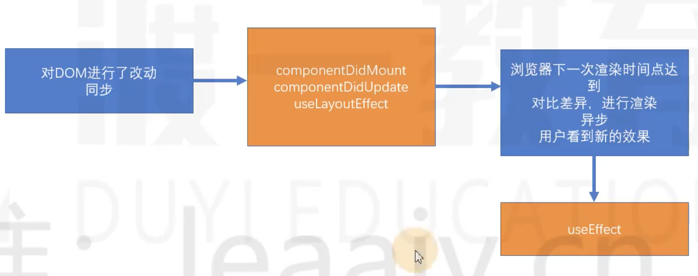

# LayoutEffect Hook

直接操作真实DOM节点时：

useEffect：浏览器渲染完成后，用户看到新的渲染结果之后，重新改变
useLayoutEffectHook：完成了DOM改动，但还没有呈现给用户

执行时机：



**注意：应该尽量使用useEffect，因为它不会导致渲染阻塞，如果出现了问题，再考虑使用useLayoutEffectHook**

代码演示：

1. 使用useEffect：点击按钮时，页面会有短暂的闪烁

    ```jsx
    import React, { useEffect, useRef, useState } from "react";
    
    export default function App() {
      const [n, setN] = useState(0);
      const pRef = useRef();
      useEffect(() => {
        pRef.current.innerText = Math.random();
      }, [n]);
      return (
        <div>
          <p ref={pRef}>{n}</p>
          <button onClick={() => setN(n + 1)}>点击啊</button>
        </div>
      );
    }
    ```

2. 使用useLayoutEffect：点击时没有闪烁，但可能会导致渲染阻塞，不建议使用，了解即可

    ```jsx
    export default function App() {
      const [n, setN] = useState(0);
      const pRef = useRef();
      useLayoutEffect(() => {
        pRef.current.innerText = Math.random();
      }, [n]);
      return (
        <div>
          <p ref={pRef}>{n}</p>
          <button onClick={() => setN(n + 1)}>点击啊</button>
        </div>
      );
    }
    ```

    