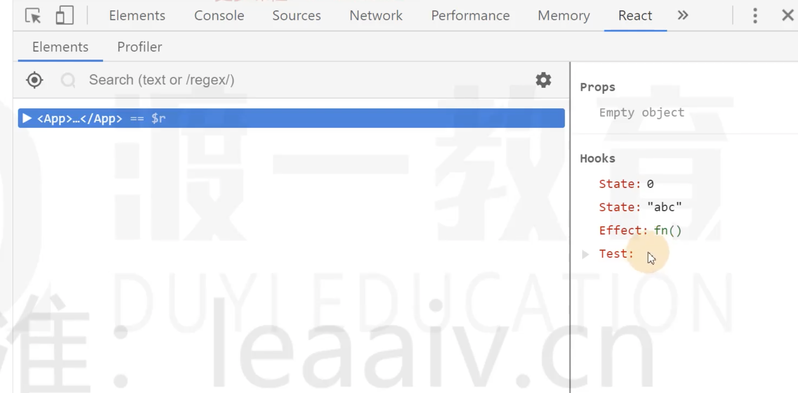
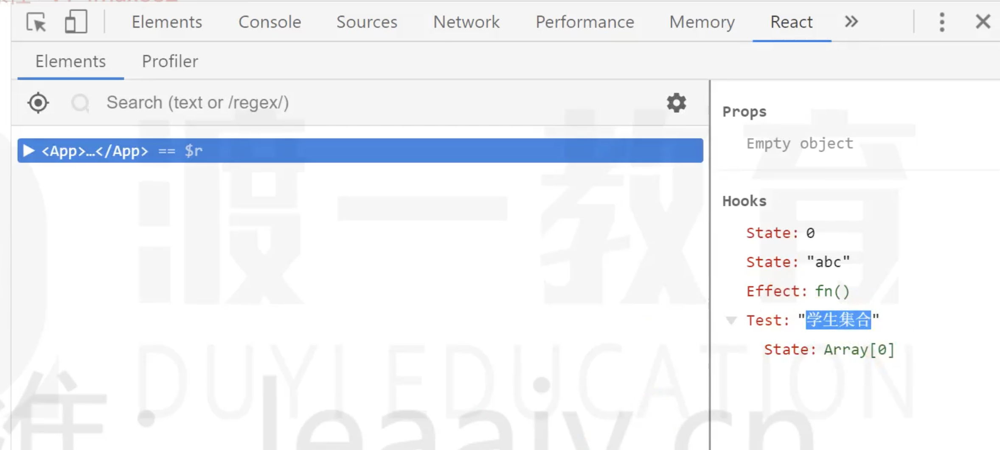

# DebugValue Hook

不常用，了解即可

useDebugValue：用于将自定义Hook的关联数据显示到调试栏

如果创建的自定义Hook通用性比较高，可以选择使用useDebugValue方便调试

代码说明：
1. 未使用DebugValue Hook

    ```jsx
    import React, { useState, useEffect, useDebugValue } from 'react'
    
    function useTest(){
        const [students, ] = useState([];
        return students;
    }
    
    export default function App() {
        useState(0)
        useState("abc")
        useEffect(() => {
            console.log("effect")
        }, [])
        useTest();
        return (
            <div>
            </div>
        )
    }
    
    ```

    调试栏显示：

    

1. 未使用DebugValue Hook

    ```jsx
    import React, { useState, useEffect, useDebugValue } from 'react'
    
    function useTest(){
        const [students, ] = useState([])
        useDebugValue("学生集合")
        return students;
    }
    
    export default function App() {
        useState(0)
        useState("abc")
        useEffect(() => {
            console.log("effect")
        }, [])
        useTest();
        return (
            <div>
            </div>
        )
    }
    
    ```

    调试栏显示：

    


​    

