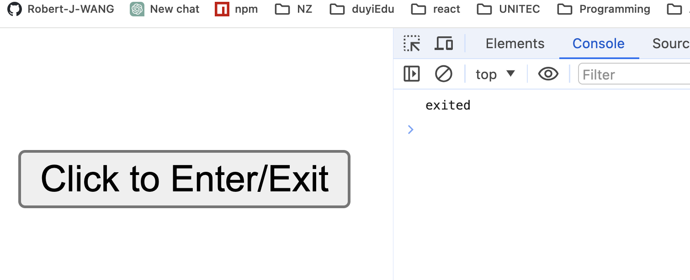
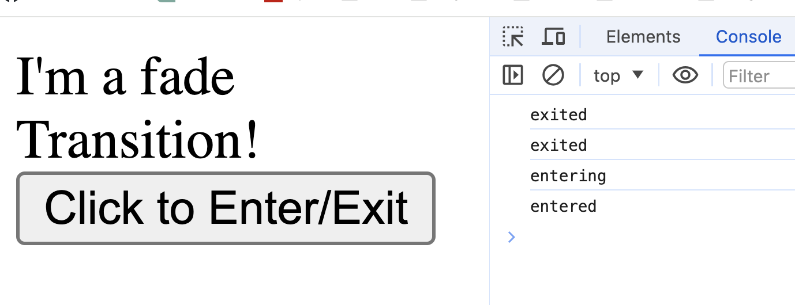
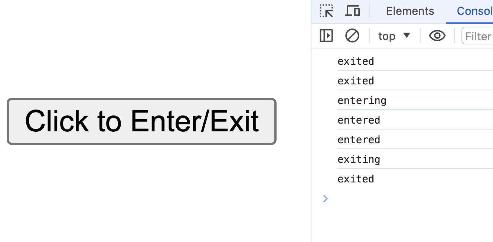

# React动画

1. React动画库：react-transition-group 

2. 地址：npm官网---》search: react-transition-group 

3. 安装使用

    ```bash
    # npm
    npm install react-transition-group --save
    
    # yarn
    yarn add react-transition-group
    ```

4. Components: 包含4个组件

    1. Transition： 最基础的组件，其他组件都建立在这个组件基础上使用

    2. CSSTransition

    3. SwitchTransition

    4. TransitionGroup

5. 使用

    1. Transition的使用

        1. 功能初体验：copy 官方文档中的实例代码到自己的工程中，做一些细微的改动

            ```jsx
            import React, { useState } from "react";
            import { Transition } from "react-transition-group";
            
            const duration = 500;
            
            const defaultStyle = {
              transition: `opacity ${duration}ms ease-in-out`,
              opacity: 0,
            };
            const transitionStyles = {
              entering: { opacity: 1 },
              entered: { opacity: 1 },
              exiting: { opacity: 0 },
              exited: { opacity: 0 },
            };
            
            export default function App() {
              const [inProp, setInProp] = useState(false);
              return (
                <div>
                  <Transition in={inProp} timeout={duration}>
                    {(state) => (
                      <div
                        style={{
                          ...defaultStyle,
                          ...transitionStyles[state],
                        }}
                      >
                        I'm a fade Transition!
                      </div>
                    )}
                  </Transition>
                  <button onClick={() => setInProp(!inProp)}>Click to Enter/Exit</button>
                </div>
              );
            }
            
            ```

            点击按钮时，实现div节点显示隐藏的过渡效果

        2. 认识Transition组件

            1. 属性in: 显示组件；触发进入或退出状态  true/false

            2. Timeout: 过渡的时间

            3. children： 一个函数，参数是state, 根据state的值来控制需要返回的内容

            4. 参数state：是4个状态值：entering，entered，exiting，exited

            5. Transition组件通过切换参数状态state的值实现过渡

                ```jsx
                /* ----------------------- 打印state ---------------------- */
                export default function App() {
                  const [inProp, setInProp] = useState(false);
                  return (
                    <div>
                      <Transition in={inProp} timeout={duration}>
                        {(state) => {
                          console.log(state); //  打印出state
                          return (
                            <div
                              style={{
                                ...defaultStyle,
                                ...transitionStyles[state],
                              }}
                            >
                              I'm a fade Transition!
                            </div>
                          );
                        }}
                      </Transition>
                      <button onClick={() => setInProp(!inProp)}>Click to Enter/Exit</button>
                    </div>
                  );
                }
                ```

                初次渲染时

                
            
                点击按钮显示div时

                

                再次点击按钮隐藏div时

                
            
            6. 其他属性：查看官网了解
        
    2. CSSTransition的使用
