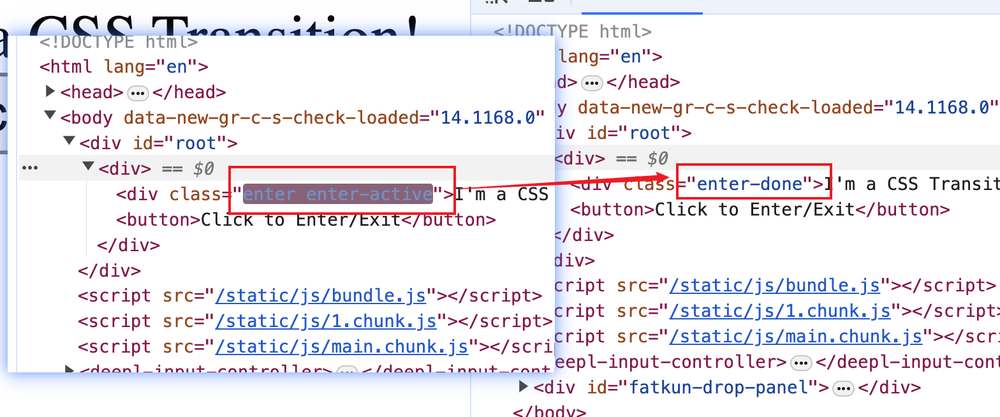

# React动画

1. React动画库：react-transition-group 

2. 地址：npm官网---》search: react-transition-group 

3. 安装使用

    ```bash
    # npm
    npm install react-transition-group --save
    
    # yarn
    yarn add react-transition-group
    ```

4. Components: 包含4个组件

    1. Transition： 最基础的组件，其他组件都建立在这个组件基础上使用

    2. CSSTransition: 最常用

    3. SwitchTransition

    4. TransitionGroup

5. 使用

    1. Transition的使用

        1. 功能初体验：copy 官方文档中的实例代码到自己的工程中，做一些细微的改动

            ```jsx
            import React, { useState } from "react";
            import { Transition } from "react-transition-group";
            
            const duration = 500;
            
            const defaultStyle = {
              transition: `opacity ${duration}ms ease-in-out`,
              opacity: 0,
            };
            const transitionStyles = {
              entering: { opacity: 1 },
              entered: { opacity: 1 },
              exiting: { opacity: 0 },
              exited: { opacity: 0 },
            };
            
            export default function App() {
              const [inProp, setInProp] = useState(false);
              return (
                <div>
                  <Transition in={inProp} timeout={duration}>
                    {(state) => (
                      <div
                        style={{
                          ...defaultStyle,
                          ...transitionStyles[state],
                        }}
                      >
                        I'm a fade Transition!
                      </div>
                    )}
                  </Transition>
                  <button onClick={() => setInProp(!inProp)}>Click to Enter/Exit</button>
                </div>
              );
            }
            
            ```

            点击按钮时，实现div节点显示隐藏的过渡效果

        2. 认识Transition组件

            1. 属性in: 显示组件；触发进入或退出状态  true/false

            2. Timeout: 过渡的时间

            3. children： 一个函数，参数是state, 根据state的值来控制需要返回的内容

            4. 参数state：是4个状态值：entering，entered，exiting，exited

            5. Transition组件通过切换参数状态state的值实现过渡

                ```jsx
                /* ----------------------- 打印state ---------------------- */
                export default function App() {
                  const [inProp, setInProp] = useState(false);
                  return (
                    <div>
                      <Transition in={inProp} timeout={duration}>
                        {(state) => {
                          console.log(state); //  打印出state
                          return (
                            <div
                              style={{
                                ...defaultStyle,
                                ...transitionStyles[state],
                              }}
                            >
                              I'm a fade Transition!
                            </div>
                          );
                        }}
                      </Transition>
                      <button onClick={() => setInProp(!inProp)}>Click to Enter/Exit</button>
                    </div>
                  );
                }
                ```

                初次渲染时

                
            
                点击按钮显示div时

                

                再次点击按钮隐藏div时

                
            
            6. 其他属性：查看官网了解
    
    2. CSSTransition的使用
    
        1. 功能初体验
    
            ```jsx
            import React, { useState } from "react";
            import { CSSTransition } from "react-transition-group";
            
            const duration = 2000;
            
            export default function App() {
              const [visable, setVisable] = useState(true);
              return (
                <div>
                  <CSSTransition in={visable} timeout={duration}>
                    <div>I'm a CSS Transition!</div>
                  </CSSTransition>
                  <button onClick={() => setVisable(!visable)}>Click to Enter/Exit</button>
                </div>
              );
            }
            ```
    
            点击按钮，查看CSSTransition内部的DOM根元素div的样式变化
    
            进入Transition状态时：
    
            
    
            退出Transition状态时：
    
            
    
            点击按钮，实现CSSTransition的进入/退出状态切换
    
            当进入时，发生：
    
            ```markdown
            1. 为CSSTransition内部的DOM根元素（后续统一称之为DOM元素）添加样式enter
            2. 在一下帧(enter样式已经完全应用到了元素)，立即为该元素添加样式enter-active
            3. 当timeout结束后，去掉之前的样式，添加样式enter-done
            ```
    
            当退出时，发生：
    
            ```markdown
             1. 为CSSTransition内部的DOM根元素（后续统一称之为DOM元素）添加样式exit
             2. 在一下帧(exit样式已经完全应用到了元素)，立即为该元素添加样式exit-active
             3. 当timeout结束后，去掉之前的样式，添加样式exit-done
            ```
    
        2. 给元素添加的样式，设置具体的内容（编写css样式）,并引入使用
    
            ```css
            /* App.css */
            .enter {
              opacity: 0;
            }
            .enter-active{
              opacity: 1;
              transition: 2s;
            }
            
            .exit {
              opacity: 1;
            }
            .exit-active{
              opacity: 0;
              transition: 2s;
            }
            
            .exit-done{
              opacity: 0;
            }
            ```
    
            这样就实现了简单的进入/退出Transition效果了
    
        3. 设置classNames属性，可以指定类样式的名称
    
            比如默认名称是“enter-active", 设置classNames属性值为“test"后，样式名变为“test-enter-active” ，其他样式名一次类推
    
            1. 字符串：为类样式添加前缀
    
                ```jsx
                import React, { useState } from "react";
                import { CSSTransition } from "react-transition-group";
                import "./App.css";
                
                const duration = 2000;
                
                export default function App() {
                  const [visable, setVisable] = useState(true);
                  return (
                    <div>
                      <CSSTransition
                        in={visable}
                        timeout={duration}
                        // 设定类样式名称
                        classNames="test"
                      >
                        <div>I'm a CSS Transition!</div>
                      </CSSTransition>
                      <button onClick={() => setVisable(!visable)}>Click to Enter/Exit</button>
                    </div>
                  );
                }
                ```
    
                
    
            2. 对象：为每个类样式指定具体的名称（非前缀）
    
                ```jsx
                import React, { useState } from "react";
                import { CSSTransition } from "react-transition-group";
                import "./App.css";
                
                const duration = 2000;
                
                // 类样式名称设置对象
                const myClassNames = {
                  appear: "my-appear",
                  appearActive: "my-active-appear",
                  appearDone: "my-done-appear",
                  enter: "my-enter",
                  enterActive: "my-active-enter",
                  enterDone: "my-done-enter",
                  exit: "my-exit",
                  exitActive: "my-active-exit",
                  exitDone: "my-done-exit",
                };
                
                export default function App() {
                  const [visable, setVisable] = useState(true);
                  return (
                    <div>
                      <CSSTransition
                        in={visable}
                        timeout={duration}
                        // 1.设定类样式名称----->字符串
                        // classNames="test"
                        // 2.设定类样式名称----->对象
                        classNames={myClassNames}
                      >
                        <div>I'm a CSS Transition!</div>
                      </CSSTransition>
                      <button onClick={() => setVisable(!visable)}>Click to Enter/Exit</button>
                    </div>
                  );
                }
                ```
    
            3. 关于appear样式的说明
    
                配置首次渲染时的类样式，使用appear属性。
    
                appear、appear-active、appear-done，它和enter的唯一区别在于完成时，在页面初次加载完成后，会同时加入appear-done和enter-done
    
                ```jsx
                import React, { useState } from "react";
                import { CSSTransition } from "react-transition-group";
                import "./App.css";
                
                const duration = 2000;
                
                // 类样式名称设置对象
                const myClassNames = {
                  appear: "my-appear",
                  appearActive: "my-active-appear",
                  appearDone: "my-done-appear",
                  enter: "my-enter",
                  enterActive: "my-active-enter",
                  enterDone: "my-done-enter",
                  exit: "my-exit",
                  exitActive: "my-active-exit",
                  exitDone: "my-done-exit",
                };
                
                export default function App() {
                  const [visable, setVisable] = useState(true);
                  return (
                    <div>
                      <CSSTransition
                        in={visable}
                        timeout={duration}
                        // 1.设定类样式名称----->字符串
                        // classNames="test"
                        // 2.设定类样式名称----->对象
                        classNames={myClassNames}
                        // 3. 添加appear属性--->设定页面初次渲染时的样式
                        appear
                      >
                        <div>I'm a CSS Transition!</div>
                      </CSSTransition>
                      <button onClick={() => setVisable(!visable)}>Click to Enter/Exit</button>
                    </div>
                  );
                }
                ```
    
        4. 综合效果展示
    
            1. 准备组件
    
                ```jsx
                import React, { useState } from "react";
                
                function Comp1(visable) {
                  return <h1>组件1</h1>;
                }
                function Comp2(visable) {
                  return <h1>组件2</h1>;
                }
                export default function App() {
                  const [showCom1, setShowCom1] = useState(true);
                  return (
                    <div>
                      <Comp1 visable={showCom1} />
                      <Comp2 visable={!showCom1} />
                      <button onClick={() => setShowCom1(!showCom1)}>显示组件1 / 组件2</button>
                    </div>
                  );
                }
                ```
    
            2. 使用动画库，配置样式
    
                ```jsx
                import React, { useState } from "react";
                import { CSSTransition } from "react-transition-group";
                import "./App.css";
                
                function Comp1({ visable }) {
                  return (
                    <CSSTransition in={visable} appear timeout={1000}>
                      <h1 className="title">组件1</h1>
                    </CSSTransition>
                  );
                }
                function Comp2({ visable }) {
                  return (
                    <CSSTransition mountOnEnter in={visable} timeout={1000}>
                      <h1 className="title">组件2</h1>
                    </CSSTransition>
                  );
                }
                export default function App() {
                  const [showCom1, setShowCom1] = useState(true);
                  return (
                    <div className="container">
                      <div className="comp-container">
                        <Comp1 visable={showCom1} />
                        <Comp2 visable={!showCom1} />
                      </div>
                      <button onClick={() => setShowCom1(!showCom1)}>显示组件1 / 组件2</button>
                    </div>
                  );
                }
                ```
    
                注意：使用appear属性设置页面初次渲染时的动画；使用mountOnEnter属性，配置懒加载：如果该组件没进入Transition状态（in=false), 页面初次渲时，不会加载该组件
    
            3. 编写样式，并引入使用
    
                ```css
                /* App.css */
                
                .container{
                  width: 100px;
                  margin: 0 auto;
                }
                .comp-container{
                  position: relative;
                  height: 100px;
                }
                .title{
                  position: absolute;
                  top: 0;
                  left: 0;
                }
                .exit-active{
                  opacity: 0;
                  transition: 1s;
                  transform: translateX(-100px);
                }
                .exit-done{
                  display: none;
                }
                .enter, .appear{
                  display: block;
                  opacity: 0;
                  transform: translateX(100px);
                }
                .enter-active, .appear-active{
                  opacity: 1;
                  transform: translateX(0);
                  transition: 1s ;
                }
                
                ```
    
        5. 结合animate.css 库的使用
    
            1. 安装animate.css 库
    
                ```bash
                yarn add animate.css
                ```
    
            2. 重新设计组件
    
                ```jsx
                import React, { useState } from "react";
                import { CSSTransition } from "react-transition-group";
                import "./App.css";
                
                /**
                 * 用于使用CSSTransitio组件实现动画过渡效果
                 * @param {*}
                 * visable: boolean 控制是否进入过渡状态
                 * children: node 组件显示的内容
                 * @returns
                 */
                function MyTransition({ visable, children }) {
                  return (
                    <CSSTransition in={visable} mountOnEnter appear timeout={1000}>
                      {children}
                    </CSSTransition>
                  );
                }
                
                export default function App() {
                  const [showCom1, setShowCom1] = useState(true);
                  return (
                    <div className="container">
                      <div className="comp-container">
                        <MyTransition visable={showCom1}>
                          <h1 className="title">组件1</h1>
                        </MyTransition>
                        <MyTransition visable={!showCom1}>
                          <h1 className="title">组件2</h1>
                        </MyTransition>
                      </div>
                      <button onClick={() => setShowCom1(!showCom1)}>显示组件1 / 组件2</button>
                    </div>
                  );
                }
                ```
    
            3. 使用animate.css库，并给2个子组件添加固定的animate样式
    
                ```jsx
                ...
                import "animate.css";
                ...
                <div className="comp-container">
                        <MyTransition visable={showCom1}>
                          <h1 className="title animate__animated animate__slow">组件1</h1>
                        </MyTransition>
                        <MyTransition visable={!showCom1}>
                          <h1 className="title animate__animated animate__slow">组件2</h1>
                        </MyTransition>
                </div>
                ...
                ```
    
            4. 配置Transition样式对象，使用animate样式
    
                ```jsx
                import React, { useState } from "react";
                import { CSSTransition } from "react-transition-group";
                import "./App.css";
                import "animate.css";
                
                // CSSTransition样式名对象
                const myClassNames = {
                  // 退出
                  exitActive: "animate__fadeOutLeft",
                  exitDone: "my-exit-done",
                  // 进入
                  enterActive: "animate__fadeInRight",
                  enterDone: "animate__jello",
                  // 页面初次加载时
                  appearActive: "animate__fadeInRight",
                };
                /**
                 * 用于使用CSSTransitio组件实现动画过渡效果
                 * @param {*}
                 * visable: boolean 控制是否进入过渡状态
                 * children: node 组件显示的内容
                 * @returns
                 */
                function MyTransition({ visable, children }) {
                  return (
                    <CSSTransition
                      in={visable}
                      mountOnEnter
                      appear
                      timeout={1000}
                      classNames={myClassNames}
                    >
                      {children}
                    </CSSTransition>
                  );
                }
                
                export default function App() {
                  const [showCom1, setShowCom1] = useState(true);
                  return (
                    <div className="container">
                      <div className="comp-container">
                        <MyTransition visable={showCom1}>
                          <h1 className="title animate__animated animate__fast">组件1</h1>
                        </MyTransition>
                        <MyTransition visable={!showCom1}>
                          <h1 className="title animate__animated animate__fast">组件2</h1>
                        </MyTransition>
                      </div>
                      <button onClick={() => setShowCom1(!showCom1)}>显示组件1 / 组件2</button>
                    </div>
                  );
                }
                ```
    
                
    
            5. 编写自定义样式App.css
    
                ```css
                /* App.css */
                
                .container{
                  width: 100px;
                  margin: 0 auto;
                }
                .comp-container{
                  position: relative;
                  height: 100px;
                }
                .title{
                  position: absolute;
                  top: 0;
                  left: 0;
                }
                .my-exit-done{
                  display: none;
                }
                ```
    
                
    
    3. SwitchTransition
    
    4. TransitionGroup
