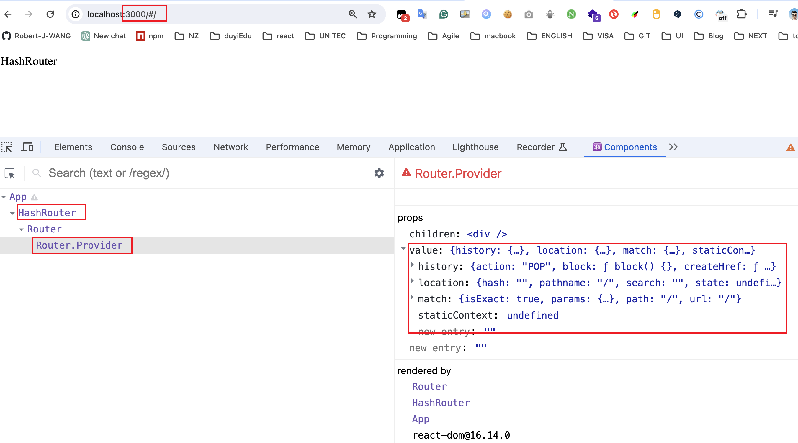
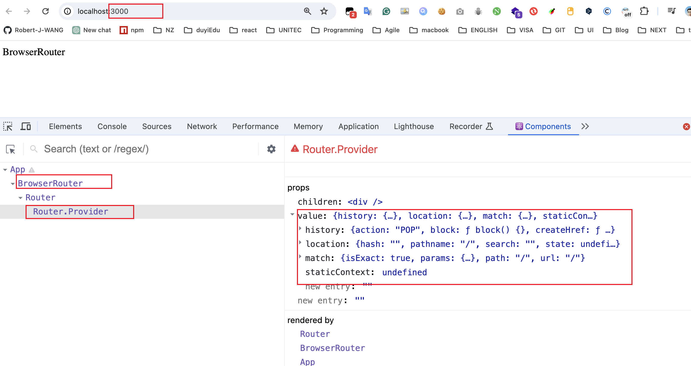
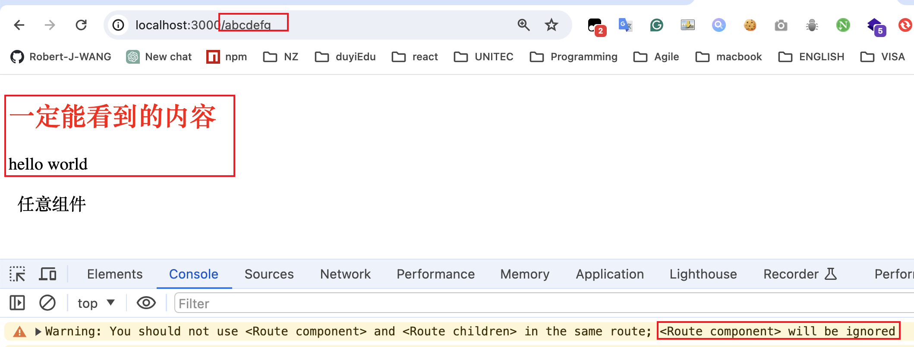
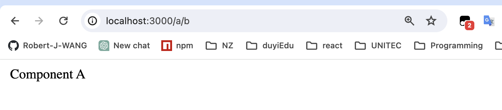
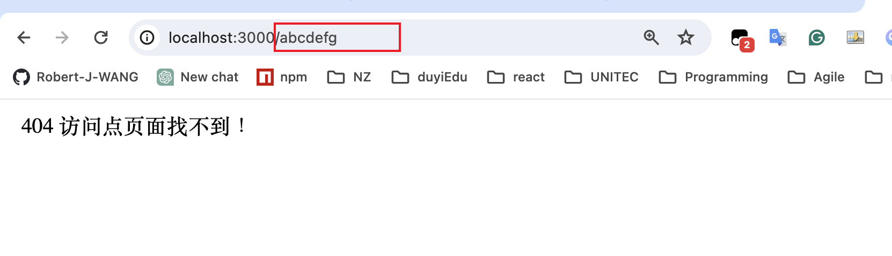

# 路由组件

React-Router 为我们提供了两个重要组件: **Router**和**Route**, 这2个组件单独使用没有任何作用，必须**组合使用**

## Router组件

它本身不做任何展示，仅提供**路由模式配置**，另外，该组件会产生一个上下文，上下文中会提供一些实用的对象和方法，供其他相关组件使用

1. HashRouter：该组件，使用hash模式匹配
2. BrowserRouter：该组件，使用BrowserHistory模式匹配

通常情况下，**BrowserRouter**更常使用。Router组件只有一个，将该组件**包裹整个页面**

```jsx
import React from "react";
import { HashRouter } from "react-router-dom";

export default function App() {
  return (
    <HashRouter>
      <div>HashRouter</div>
    </HashRouter>
  );
}
```



```jsx
import React from "react";
import {BrowserRouter } from "react-router-dom";

export default function App() {
  return (
    <BrowserRouter>
      <div>BrowserRouter</div>
    </BrowserRouter>
  );
}
```




## Route组件

根据不同的地址，展示不同的组件

重要属性：

1. path：匹配的路径
   1. 默认情况下，不区分大小写，可以设置sensitive属性为true，来区分大小写
   2. 默认情况下，只匹配初始目录，如果要精确匹配，配置exact属性为true
   3. 如果不写path，则会匹配任意路径

2. component：匹配成功后要显示的组件

    ```jsx
    import React from "react";
    import { BrowserRouter, Route } from "react-router-dom";
    
    // "/a"
    function CompA() {
      return <div> Component A</div>;
    }
    // "a/b"
    function CompAB() {
      return <div> Component AB</div>;
    }
    // "a/c"
    function CompAC() {
      return <div> Component AC</div>;
    }
    
    //不设置路径
    function CompAny() {
      return <div>  任意组件</div>;
    }
    export default function App() {
      return (
        <BrowserRouter>
          {/* exact属性为true,路径精确匹配 */}
          <Route path="/a" component={CompA} exact />
          {/* 设置sensitive属性为true，来区分大小写 */}
          <Route path="/a/b" component={CompAB} sensitive />
          <Route path="/a/c" component={CompAC} />
          {/* 不写path，则会匹配任意路径 */}
          <Route component={CompAny} />
        </BrowserRouter>
      );
    }
    ```

3. children（了解一下）：
   1. 传递React元素，无论是否匹配，一定会显示children，并且会忽略component属性
   
       ```jsx
       import React from "react";
       import { BrowserRouter, Route, Switch } from "react-router-dom";
       
       /* -------------------- 1. Route组件的使用 ------------------- */
       // "/a"
       function CompA() {
         return <div> Component A</div>;
       }
       // "a/b"
       function CompAB() {
         return <div> Component AB</div>;
       }
       // "a/c"
       function CompAC() {
         return <div> Component AC</div>;
       }
       
       //不设置路径
       function CompAny() {
         return <div>  任意组件</div>;
       }
       export default function App() {
         return (
           <BrowserRouter>
             {/* exact属性为true,路径精确匹配 */}
             <Route path="/a" component={CompA} exact>
               <h2 style={{ color: "red" }}>一定能看到的内容</h2>
               <p>hello world</p>
             </Route>
             {/* 设置sensitive属性为true，来区分大小写 */}
             <Route path="/a/b" component={CompAB} sensitive />
             <Route path="/a/c" component={CompAC} />
             {/* 不写path，则会匹配任意路径 */}
             <Route component={CompAny} />
           </BrowserRouter>
         );
       }
       
       ```
        
       
       
   
   
   2. 传递一个函数，该函数有多个参数，这些参数来自于上下文，该函数返回react元素，则一定会显示返回的元素，并且忽略component属性
   
       ```jsx
       import React from "react";
       import { BrowserRouter, Route, Switch } from "react-router-dom";
       
       /* -------------------- 1. Route组件的使用 ------------------- */
       // "/a"
       function CompA() {
         return <div> Component A</div>;
       }
       // "a/b"
       function CompAB() {
         return <div> Component AB</div>;
       }
       // "a/c"
       function CompAC() {
         return <div> Component AC</div>;
       }
       
       //不设置路径
       function CompAny() {
         return <div>  任意组件</div>;
       }
       export default function App() {
         return (
           <BrowserRouter>
             {/* exact属性为true,路径精确匹配 */}
             <Route path="/a" component={CompA} exact>
               {() => {
                 return (
                   <div>
                     <h2 style={{ color: "red" }}>一定能看到的内容</h2>
                     <p>hello world</p>
                   </div>
                 );
               }}
             </Route>
             {/* 设置sensitive属性为true，来区分大小写 */}
             <Route path="/a/b" component={CompAB} sensitive />
             <Route path="/a/c" component={CompAC} />
             {/* 不写path，则会匹配任意路径 */}
             <Route component={CompAny} />
           </BrowserRouter>
         );
       }
       ```
   
               

Route组件可以写到任意的地方，只要保证它是Router组件的后代元素

## Switch组件

1. 写到Switch组件中的Route组件，当匹配到第一个Route后，会立即停止匹配

    ```jsx
    import React from "react";
    import { BrowserRouter, Route, Switch } from "react-router-dom";
    
    // "/a"
    function CompA() {
      return <div> Component A</div>;
    }
    // "a/b"
    function CompAB() {
      return <div> Component AB</div>;
    }
    // "a/c"
    function CompAC() {
      return <div> Component AC</div>;
    }
    
    //不设置路径
    function CompAny() {
      return <div>  任意组件</div>;
    }
    export default function App() {
      return (
        <BrowserRouter>
          <Switch>
            <Route path="/a" component={CompA} />
            <Route path="/a/b" component={CompAB} />
            <Route path="/a/c" component={CompAC} />
            <Route component={CompAny} />
          </Switch>
        </BrowserRouter>
      );
    }
    ```

    

​	**注意：上面的访问地址，当匹配到` <Route path="/a" component={CompA} />`时，就停止其他的匹配了**。

2. 利用上面的特性，可以设置一个访问错误的页面

    ```jsx
    import React from "react";
    import { BrowserRouter, Route, Switch } from "react-router-dom";
    function CompA() {
      return <div> Component A</div>;
    }
    // "a/b"
    function CompAB() {
      return <div> Component AB</div>;
    }
    // "a/c"
    function CompAC() {
      return <div> Component AC</div>;
    }
    
    //不设置路径
    function ErrorPage() {
      return <div>  404 访问点页面找不到！</div>;
    }
    export default function App() {
      return (
        <BrowserRouter>
          <Switch>
            <Route path="/a" component={CompA} />
            <Route path="/a/b" component={CompAB} />
            <Route path="/a/c" component={CompAC} />
            <Route component={ErrorPage} />
          </Switch>
        </BrowserRouter>
      );
    }
    ```

    

    **注意：上面的访问地址，无法匹配到 组件时，就匹配无路径的组件` <Route component={ErrorPage} />`**

3. 由于Switch组件会循环所有子元素—Route组件，然后让每个子元素去完成匹配，若匹配到，则渲染对应的组件，然后停止循环。因此，不能在Switch的子元素中使用除Route外的其他组件。比如div等，因为其他组件没有Route组件提供的path， component等属性，所以无法完成匹配功能，进而会报警告

    ```jsx
    <BrowserRouter>
          <Switch>
            <Route path="/a" component={CompA} />
            <Route path="/a/b" component={CompAB} />
            <Route path="/a/c" component={CompAC} />
            {/* 不能再Switch组件中使用出Route之外的其他组件，比如div */}
            <div>i am a div</div>
            <Route component={ErrorPage} />
          </Switch>
        </BrowserRouter>
    ```

         

4. 阿斯顿发

