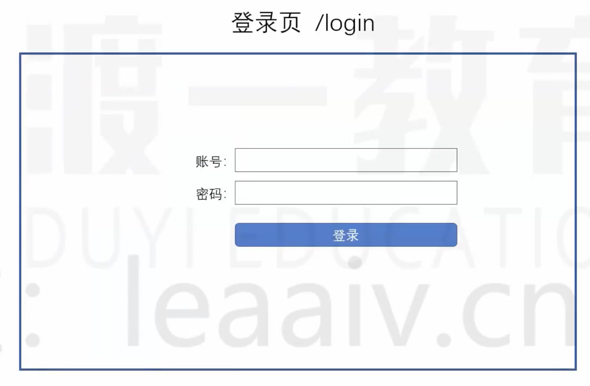
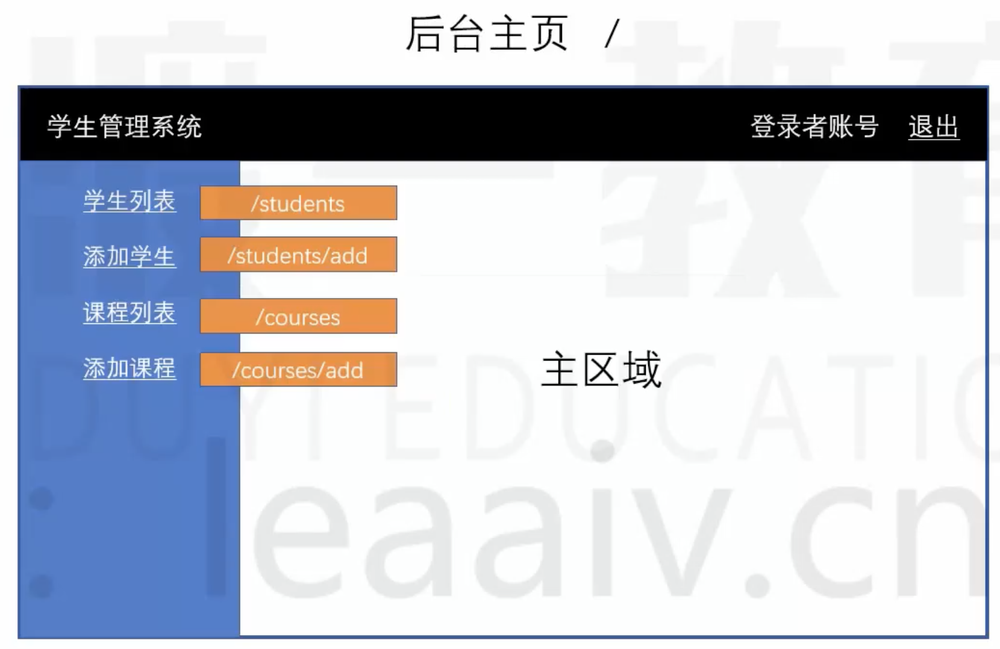
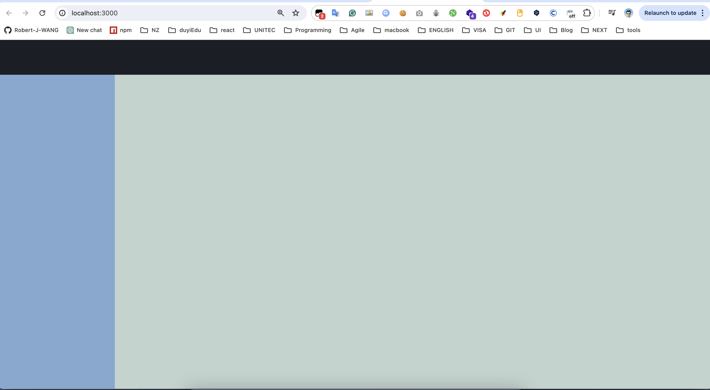
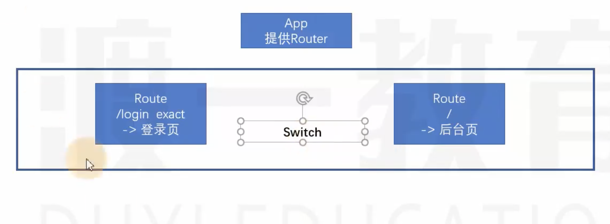
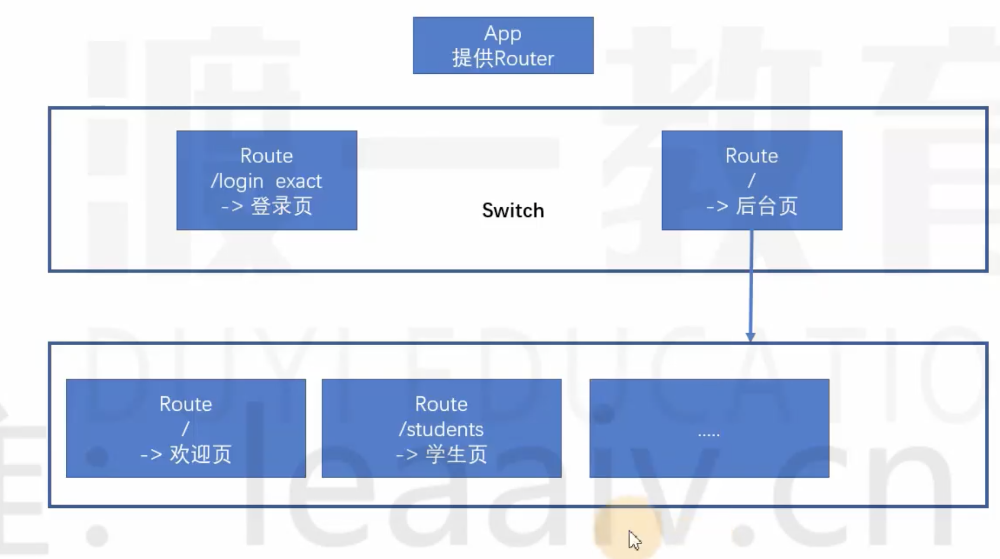
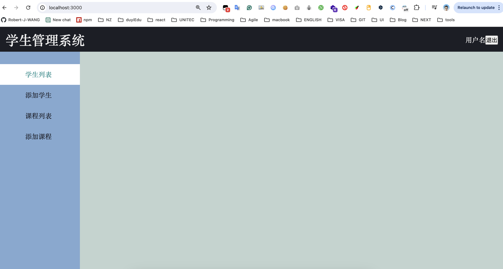

1. 页面布局设计

    1. 登录页： "/login"
        

    2. 后台管理系统主页： "/"
            

    3. 其他页面：
        学生列表："/students"
        添加学生："/students/add"
        课程列表："/courses"
        添加课程："/courses/add"

2. 创建布局Layout组件，专门用于对整个页面的布局，与数据和路由无关

    1. common文件夹中创建Layout布局组件，创建jsx和css样式

        ```jsx
        import React, { Component } from "react";
        import PropTypes from "prop-types";
        import "./index.css";
        
        export default class index extends Component {
          static propTypes = {
            header: PropTypes.element, // 头部区显示的内容
            aside: PropTypes.element, // 左侧栏显示的内容
            children: PropTypes.element,// 右侧内容栏显示的内容
          };
          render() {
            console.log(this.props.header);
            return (
              <div className="container">
                {/* 头部区 */}
                <header className="header">{this.props.header}</header>
                {/* 中间区域 */}
                <div className="middle">
                  {/* 左侧栏 */}
                  <aside className="aside">{this.props.aside}</aside>
                  {/* 右侧内容栏 */}
                  <main className="main">{this.props.children}</main>
                </div>
              </div>
            );
          }
        }
        ```

        ```css
        /* 页面布局容器，撑满这个视口页面 */
        .container {
          position: fixed;
          left: 0;
          top: 0;
          height: 100%;
          width: 100%;
        }
        .container .header {
          height: 60px;
          width: 100%;
          background-color: #1c1e26;
          color: #f1f1f1;
        }
        .container .middle {
          position: absolute;
          top: 60px;
          left: 0;
          width: 100%;
          bottom: 0;
          overflow: hidden;
        }
        .container .middle .aside {
          position: absolute;
          left: 0;
          top: 0;
          width: 200px;
          height: 100%;
          background-color: #82a8d2;
          overflow: auto;
        }
        .container .middle .main {
          position: absolute;
          left: 200px;
          top: 0;
          right: 0;
          height: 100%;
          background-color: #c1d3cf;
        }
        
        ```

    2. App组件中使用Layout并测试

        ```jsx
        import React from "react";
        import "./App.css";
        import Layout from "./common/Layout";
        
        export default function App() {
          return (
            <div>
              <Layout />
            </div>
          );
        }
        ```
            
        

3. 路由组件的编写

    1. 分析路由结构

        

    2. 编写路由结构代码

        ```jsx
        import React from "react";
        import "./App.css";
        import {BrowserRouter as Router,Switch,Route} from "react-router-dom";
        
        export default function App() {
          return (
            <Router>
              <Switch>
                <Route path="/login" exact component={???}/>
                <Route path="/" component={???}/>
              </Switch>
            </Router>
          );
        }
        ```

    3. 编写具体的路由界面

        src下新建文件夹pages, 并创建登录Login组件和后台Admin组件

        ```jsx
        import React from "react";
        
        export default function Login() {
          return <div>Login</div>;
        }
        ```

        ```jsx
        import React from "react";
        
        export default function Admin() {
          return <div>Admin</div>;
        }
        ```

        App组件中引入并使用

        ```jsx
        import React from "react";
        import "./App.css";
        import { BrowserRouter as Router, Switch, Route } from "react-router-dom";
        import Login from "./pages/Login";
        import Admin from "./pages/Admin";
        
        export default function App() {
          return (
            <Router>
              <Switch>
                <Route exact path="/login" component={Login} />
                <Route path="/" component={Admin} />
              </Switch>
            </Router>
          );
        }    
        ```

4. 后台Admin组件的细化

    1. Admin组件路由细化分析

        

    2. Admin组件使用布局组件，并传入props属性header，aside

        ```jsx
        import React from "react";
        import Layout from "../../components/Layout";
        import Header from "../../components/Header";
        import Menu from "../../components/Menu";
        
        export default function Admin() {
          return (
            <Layout header={<Header />} aside={<Menu />}>
              {/* {"children "} */}
            </Layout>
          );
        }
        ```

        这样：当访问每个路由路径时，都能访问到相同的地址"/",这个路径中使用了统一的样式Layout组件。不同的地方只是` <Layout header={<Header />} aside={<Menu />}>{/* {"children "} */}</Layout>`里children内容。

    3. 编写Header组件

        ```jsx
        import React from "react";
        import "./index.css";
        
        export default function Header() {
          return (
            <div className="header-content">
              <div className="left">
                <h1>学生管理系统</h1>
              </div>
              <div className="right">
                <span>用户名</span>
                <button>退出</button>
              </div>
            </div>
          );
        }
        ```

    4. 编写Menu组件

        ```jsx
        import React from 'react'
        import "./index.css"
        
        export default function Menu() {
            return (
                <ul className="menu">
                    <li><a href="/students">学生列表</a></li>
                    <li><a href="/students/add">添加学生</a></li>
                    <li><a href="/courses">课程列表</a></li>
                    <li><a href="/courses/add">添加课程</a></li>
                </ul>
            )
        }
        ```

                

5. 使用Route组件，完成学生列表和课程列表的渲染

    1. 分别创建Welcome, StudentList, StudentAdd, CourseList, CourseAdd组件

        ```jsx
        import React from "react";
        
        export default function Welcome() {
          return <div>Welcome</div>;
        }
        ```

        ```jsx
        import React from 'react'
        
        export default function StudentList() {
            return (
                <div>
                    <h1>学生列表页</h1>
                </div>
            )
        }
        ```

        ```jsx
        import React from 'react'
        
        export default function StudentAdd() {
            return (
                <div>
                    <h1>添加学生页</h1>
                </div>
            )
        }
        ```

        ```jsx
        import React from 'react'
        
        export default function StudentList() {
            return (
                <div>
                    <h1>课程列表页</h1>
                </div>
            )
        }
        ```

        ```jsx
        import React from 'react'
        
        export default function StudentAdd() {
            return (
                <div>
                    <h1>添加课程页</h1>
                </div>
            )
        }
        ```

        

    2. Admin组件中使用Route组件，匹配渲染对应的组件

        ```jsx
        import React from "react";
        import { Route } from "react-router-dom";
        import Layout from "../../components/Layout";
        import Header from "../../components/Header";
        import Menu from "../../components/Menu";
        import Welcome from "../Welcome/index";
        import StudentList from "../student/StudentList";
        import StudentAdd from "../student/StudentAdd";
        import CourseList from "../course/CourseList";
        import CourseAdd from "../course/CourseAdd";
        
        export default function Admin() {
          return (
            <Layout header={<Header />} aside={<Menu />}>
              {/* {"children "} */}
              <Route path="/" exact component={Welcome} />
              <Route path="/students" exact component={StudentList} />
              <Route path="/students/add" exact component={StudentAdd} />
              <Route path="/courses" exact component={CourseList} />
              <Route path="/courses/add" exact component={CourseAdd} />
            </Layout>
          );
        }
        ```

        


