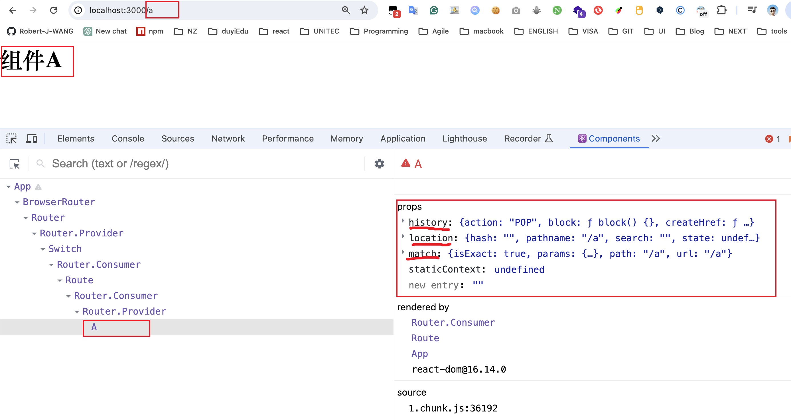
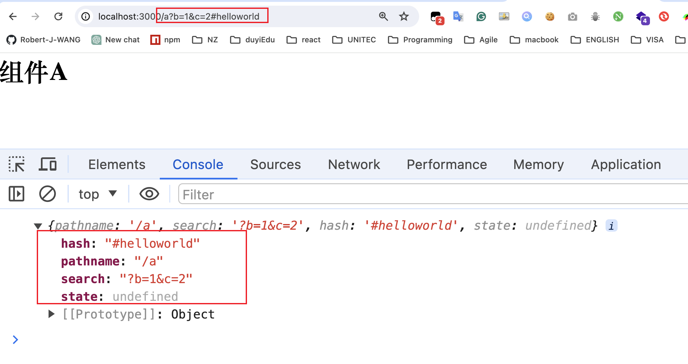
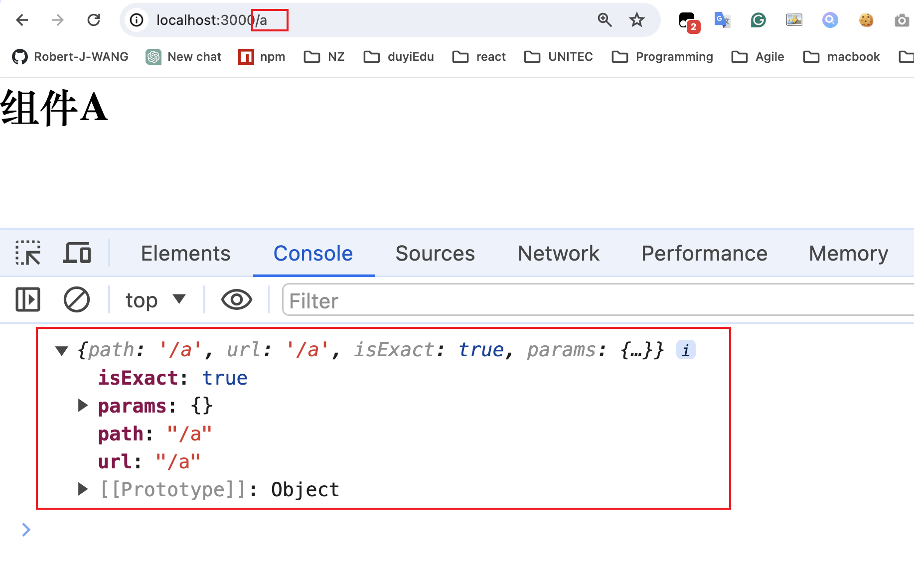
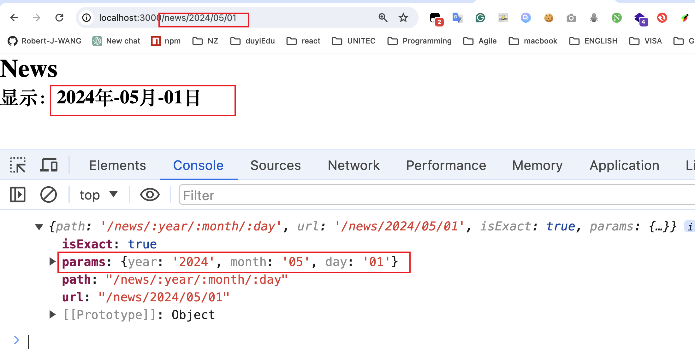

# 路由信息

Router组件会创建一个上下文，并且，向上下文中注入一些信息

该上下文对开发者是隐藏的，Route组件若匹配到了地址，则会将这些上下文中的信息作为属性传入对应的组件

```jsx
import React from "react";
import "./App.css";
import { BrowserRouter as Router, Route, Switch } from "react-router-dom";

function A() {
  return <h1> 组件A</h1>;
}
function B() {
  return <h1> 组件A</h1>;
}
function C() {
  return <h1> Not Found</h1>;
}

export default function App() {
  return (
    <Router>
      <Switch>
        <Route path="/a" component={A} />
        <Route path="/b" component={B} />
        <Route component={C} />
      </Switch>
    </Router>
  );
}
```




## history

它并不是window.history对象，我们利用该对象无刷新跳转地址

**为什么没有直接使用history对象**

1. React-Router中有两种模式：Hash、History，如果直接使用window.history，只能支持一种模式
2. 当使用windows.history.pushState方法时，没有办法收到任何通知，将导致React无法知晓地址发生了变化，结果导致无法重新渲染组件

- push：将某个新的地址入栈（历史记录栈）
  - 参数1：新的地址
  - 参数2：可选，附带的状态数据
  
  ```JSX
  function A(props) {
    return (
      <div>
        <h1> 组件A</h1>
        <button onClick={() => props.history.push("/b")}>跳转到组件B</button>
      </div>
    );
  }
  function B(props) {
    return (
      <div>
        <h1> 组件B</h1>
        <button onClick={() => props.history.push("/a")}>跳转到组件A</button>
      </div>
    );
  }
  ```
  
- replace：将某个新的地址替换掉当前栈中的地址

- go: 与window.history一致

- forward: 与window.history一致

- back: 与window.history一致

## location

与history.location完全一致，是同一个对象，但是，与window.location不同

location对象中记录了当前地址的相关信息

```jsx
import React from "react";
import "./App.css";
import { BrowserRouter as Router, Route, Switch } from "react-router-dom";

function A(props) {
  console.log(props.location);  // {pathname: '/a', search: '', hash: '', state: undefined, key: 'ufu6zn'}
  return (
    <div>
      <h1> 组件A</h1>
    </div>
  );
}

function C() {
  return <h1> Not Found</h1>;
}

export default function App() {
  return (
    <Router>
      <Switch>
        <Route path="/a" component={A} />
        <Route component={C} />
      </Switch>
    </Router>
  );
}

```



**注意：**

​	由于location对象里分离出的路径信息都是字符串形式的。使用过程中很不方便。

​	我们通常使用**第三方库```query-string```**，用于解析地址栏中的数据-->将字符串解析成对象

 1. 安装query-string

    ```bash
    yarn add query-string
    ```

 2. 引入query-string库并使用

    ```jsx
    import React from "react";
    import "./App.css";
    import { BrowserRouter as Router, Route, Switch } from "react-router-dom";
    import queryString from "query-string";
    
    function A(props) {
      console.log(props.location);
      // {pathname: '/a', search: '', hash: '', state: undefined, key: 'ufu6zn'}
      const searchOjb = queryString.parse(props.location.search);
      const hashOjb = queryString.parse(props.location.hash);
      console.log(searchOjb, hashOjb);
      return (
        <div>
          <h1> 组件A</h1>
          <p>
            地址参数：a={searchOjb.a}, b={searchOjb.b}
          </p>
          <p>hash:{hashOjb.hello} </p>
        </div>
      );
    }
    
    function C() {
      return <h1> Not Found</h1>;
    }
    
    export default function App() {
      return (
        <Router>
          <Switch>
            <Route path="/a" component={A} />
            <Route component={C} />
          </Switch>
        </Router>
      );
    }
    ```

    

## match

该对象中保存了，路由匹配的相关信息

- isExact：事实上，当前的路径和路由配置的路径是否是精确匹配的
- params：获取路径规则中对应的数据

```jsx
import React from "react";
import "./App.css";
import { BrowserRouter as Router, Route, Switch } from "react-router-dom";

function A(props) {
  console.log(props.match);
   return (
    <div>
      <h1> 组件A</h1>
    </div>
  );
}

function C() {
  return <h1> Not Found</h1>;
}

export default function App() {
  return (
    <Router>
      <Switch>
        <Route path="/a" component={A} />
        <Route component={C} />
      </Switch>
    </Router>
  );
}
```




**那么react-route是怎么知道路径中数据的具体对应顺序和名称的呢？**

实际上，在书写Route组件的path属性时，可以书写一个```string pattern```（字符串正则）

1. 匹配规则：

    `/news/:year/:month/:day`

2. 匹配结果：

    `/news/2024/05/01`

3. 匹配数据保存到match对象的params属性中

    ```js
    params: {year: '2024', month: '05', day: '01'}
    ```

4. 代码编写

    ```jsx
    import React from "react";
    import "./App.css";
    import { BrowserRouter as Router, Route, Switch } from "react-router-dom";
    
    function News(props) {
      console.log(props.match);
      const { year, month, day } = props.match.params;
      return (
        <div>
          <h1> News</h1>
          <h2>
            显示：{year}年-{month}月-{day}日
          </h2>
        </div>
      );
    }
    
    function C() {
      return <h1> Not Found</h1>;
    }
    
    export default function App() {
      return (
        <Router>
          <Switch>
            {/* path="/news/:year/:month/:day" 路径中包含params匹配规则 */}
            <Route path="/news/:year/:month/:day" component={News} />
            <Route component={C} />
          </Switch>
        </Router>
      );
    }
    ```

    

5. 匹配规则的扩展：

    1. 对于可选参数的传递，添加问号

        `/news/:year/:month?/:day?`

    2. 对于参数类型的限制，添加正则表达式，比如年月日必须是数字

        `/news/:year(\d+)/:month(\d+)/:day(\d+)`

    3. path路径还可以是数组，即匹配数组中的任意一个路径

        `path**=**{["/news/:year/:month/:day", "/news/:year?", "/news/123"]}`

    4. react-router使用了第三方库：Path-to-RegExp，该库的作用是，将一个字符串正则转换成一个真正的正则表达式。

        

**向某个页面传递数据的方式：**

1. 使用state：在push页面时，加入state(不常用)

2. **利用search：把数据填写到地址栏中的？后**

    `/news?year=2024&month=05&day=01`

3. 利用hash：把数据填写到hash后（不常用）

4. **params：把数据填写到路径中(更简洁直观)**

    `/news/2024/05/01`


## 非路由组件获取路由信息

某些组件，并没有直接放到Route中，而是嵌套在其他普通组件中，因此，它的props中没有路由信息

```jsx
import React from "react";
import "./App.css";
import { BrowserRouter as Router, Route, Switch } from "react-router-dom";

function News(props) {
  return (
    <div>
      <h1> News</h1>
      <A />
    </div>
  );
}
function A(props) {
  return (
    <div>
      <h3>Component A</h3>
      <button onClick={() => props.history.push("/")}>点击返回</button>
    </div>
  );
}

function C() {
  return <h1> Not Found</h1>;
}

export default function App() {
  return (
    <Router>
      <Switch>
        <Route path="/news" component={News} />
        <Route component={C} />
      </Switch>
    </Router>
  );
}
```


此时，点击返回按钮时，会报错：组件A无法获取路由组件信息


如果这些组件需要获取到路由信息，可以使用下面两种方式：

1. 将路由信息从父组件一层一层传递到子组件

    ```jsx
    function News(props) {
      return (
        <div>   
          <h1> News</h1>
          {/* 方法1：逐层传递props */}
          <A {...props} />
        </div>
      );
    }
    ```

    

2. 使用react-router提供的高阶组件withRouter，包装要使用的组件，该高阶组件会返回一个新组件，新组件将向提供的组件注入路由信息。

    ```jsx
    import { BrowserRouter as Router, Route, Switch, withRouter} from "react-router-dom";
    
    const AWraper = withRouter(A);
    function News(props) {
      return (
        <div>
          <h1> News</h1>
          {/* 方法2：使用react-router提供的高阶组件withRouter包装 */}
          <AWraper />
        </div>
      );
    }
    ```

    