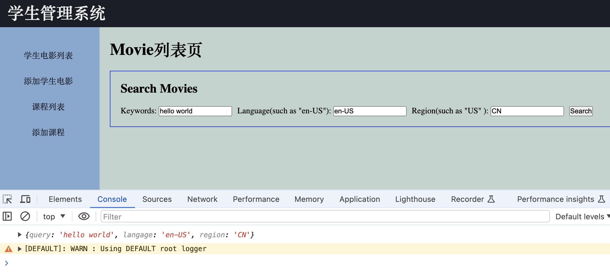
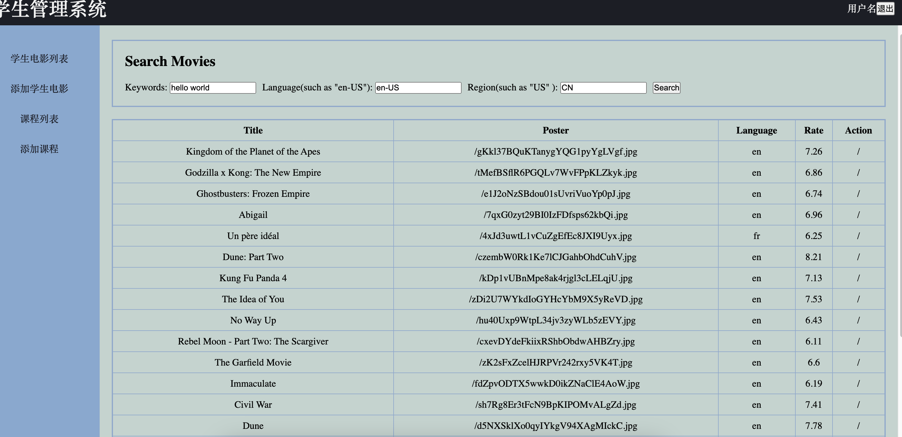
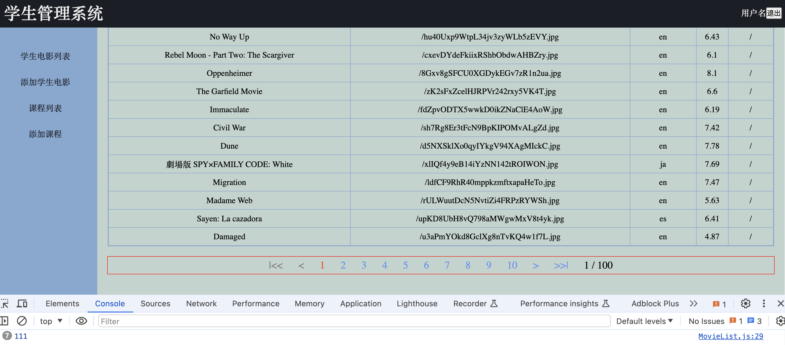
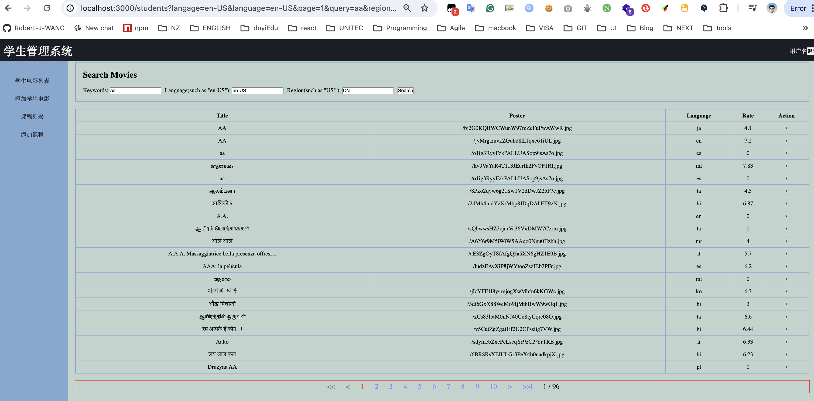
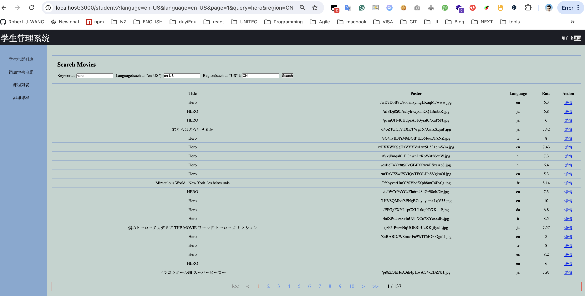
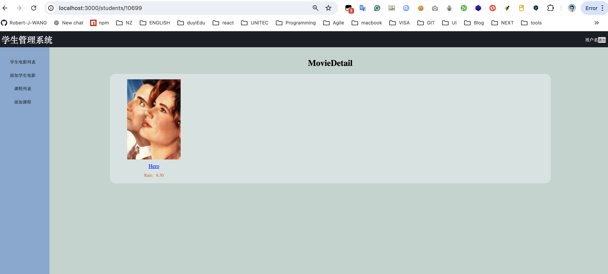

## 电影列表查询

api地址：https://developer.themoviedb.org/reference/search-movie

1. 创建查询电影的API

    1. 逻辑思路：根据关键字查询电影，如果关键字为空时，则返回正在热播的电影列表。否则，根据关键字搜索

    2. server文件夹的movieAPI文件中添加新的方法**getNowPlayingMovies**， 获取正在热播的电影列表

         ```js
         /**
          * 获取正在上映的电影列表
          * @param {*} page 显示当前的页数-默认值是1
          * 可选参数：language， region
          * @returns
          */
         export async function getNowPlayingMovies(page=1) {
           // 先在package.json中配置代理，方便维护更改
           const res = await axios.get("/3/movie/now_playing", {
             params: { page },
             headers: { Authorization: "Bearer " + TOKEN },
           });
           return res.data;
         }
         ```

    3. server文件夹的movieAPI文件中添加新的方法**searchMovies**, 根据关键字搜索电影

        ```js
        /**
         * 根据关键字搜索电影
         * @param {*} page 当前的显示的页码
         * @param {*} query 输入搜索的关键字
         * @param {*} language 语言（可选）
         * @param {*} region 地区（可选）
         * @returns
         */
        export async function searchMovies(page = 1, query, language, region) {
          if (query) {
            const res = await axios.get("https://api.themoviedb.org/3/search/movie", {
              params: {
                page,
                query,
                language,
                region,
              },
              headers: { Authorization: "Bearer " + TOKEN },
            });
            return res.data;
          } else {
            return await getNowPlayingMovies(page);
          }
        }
        ```

2. 编写查询组件，使用文本框，获取查询数据

    1. component文件夹下创建组件MovieSearchBar

        ```jsx
        import React, { Component } from "react";
        import "./index.css";
        
        export default class MovieSearchBar extends Component {
          // state = {
          //   query: "",
          //   langage: "en-US",
          //   region: "",
          // };
          constructor(props) {
            super(props);
            const defaultState = {
              query: "",
              langage: "en-US",
              region: "",
            };
            // 混合一下状态：如果没有传递过来的props里的defaultValue，则使用defaultState，否则，将传递过来的defaultValue与defaultState混合，结果设置为初始状态值
            // 这样就可以在使用MovieSearchBar组件时，设置默认属性了
            this.state = Object.assign({}, defaultState, props.defaultValue);
          }
          handleSearch = () => {
            // 抛出事件
            if (this.props.onSearch) {
              this.props.onSearch(this.state);
            }
          };
        
          render() {
            return (
              <div className="searchBar">
                <h2 className="searchTitle">Search Movies</h2>
                <div className="searchForm">
                  <span>
                    Keywords:{" "}
                    <input
                      type="text"
                      value={this.state.query}
                      onChange={(e) => {
                        this.setState({ ...this.state, query: e.target.value });
                      }}
                    />
                  </span>
                  <span>
                    Language(such as "en-US"):{" "}
                    <input
                      type="text"
                      value={this.state.langage}
                      onChange={(e) => {
                        this.setState({ ...this.state, langage: e.target.value });
                      }}
                    />
                  </span>
                  <span>
                    Region(such as "US" ):{" "}
                    <input
                      type="text"
                      value={this.state.region}
                      onChange={(e) => {
                        this.setState({ ...this.state, region: e.target.value });
                      }}
                    />
                  </span>
                  <button onClick={this.handleSearch}>Search</button>
                </div>
              </div>
            );
          }
        }
        
        ```

        

    2. MovieList组件中使用MovieSearchBar，并传递属性defaultValue和onSearch

        ```jsx
        import React from "react";
        import MovieSearchBar from "../../components/MovieSearchBar";
        
        export default function MovieList() {
          return (
            <div>
              <h1>Movie列表页</h1>
              <MovieSearchBar
                defaultValue={{
                  query: "hello world",
                  langage: "en-US",
                  region: "CN",
                }}
                onSearch={(cond) => {
                  console.log(cond);
                }}
              />
            </div>
          );
        }
        ```
    3. 测试效果
        

3. 编写表格组件，用于展示电影数据

    1. component文件夹下创建组件MovieTable

        ```jsx
        import React from "react";
        import "./index.css";
        
        export default function MovieTable(props) {
          const trs = props.results.map((m) => (
            <tr key={m.id}>
              <td>{m.original_title}</td>
              <td>{m.poster_path}</td>
              <td>{m.original_language}</td>
              <td>{+m.vote_average.toFixed(2)}</td>
              <td>/</td>
            </tr>
          ));
          return (
            <table className="table">
              <thead>
                <tr>
                  <th>Title</th>
                  <th>Poster</th>
                  <th>Language</th>
                  <th>Rate</th>
                  <th>Action</th>
                </tr>
              </thead>
              <tbody>{trs}</tbody>
            </table>
          );
        }
        ```

        

    2. MovieList组件中使用MovieTable，临时调用movieAPI文件中的方法**searchMovies**，使用hooks获取数据并传递给组件MovieTable

        ```jsx
        import React, { useState, useEffect } from "react";
        import MovieSearchBar from "../../components/MovieSearchBar";
        import MovieTable from "../../components/MovieTable";
        import { searchMovies } from "../../server/movieAPI";
        
        export default function MovieList() {
          const [movies, setMovies] = useState([]);
          useEffect(() => {
            searchMovies().then((resp) => setMovies(resp.results));
          }, []);
          return (
            <div>
              <MovieSearchBar
                defaultValue={{
                  query: "hello world",
                  langage: "en-US",
                  region: "CN",
                }}
                onSearch={(cond) => {
                  console.log(cond);
                }}
              />
              <MovieTable results={movies} />
            </div>
          );
        }
        ```

    3. 测试效果
        
        

4. 编写分页组件，使用之前已经编写过的通用组件Pager

    1. 使用之前编写过的Pager组件

        ```jsx
        import React from "react";
        import "./Pager.css";
        
        /**
         *
         * @param {*} props
         * currentPage :当前页数
         * pageNumber :页容量
         * totalPage :总页数
         * handerClick :回调函数
         * @returns
         */
        export default function Pager(props) {
          const {
            currentPage,
            pageNumber = 10, //设置默认值
            totalPage,
            handerClick,
          } = props;
        
          const min = getMin(currentPage, pageNumber, totalPage);
          const max = getMax(min, pageNumber);
          const pageNumbers = getPageNumbers(min, max);
          if (!totalPage) {
            return null;
          }
          return (
            <div className="container">
              {/* 首页 */}
              <span
                className={`pager ${currentPage === 1 ? "disabled" : ""}`}
                onClick={() => {
                  const targetPage = 1;
                  handerClick(targetPage);
                }}
              >
                {"|<<"}
              </span>
              {/* 上一页 */}
              <span
                className={`pager ${currentPage === 1 ? "disabled" : ""}`}
                onClick={() => {
                  const targetPage = currentPage <= 1 ? 1 : currentPage - 1;
                  handerClick(targetPage);
                }}
              >
                {"<"}
              </span>
              {/* 数字页 */}
              {pageNumbers.map((page, i) => (
                <span
                  key={i}
                  className={`pager ${currentPage === page ? "active" : ""}`}
                  onClick={() => {
                    const targetPage = page;
                    handerClick(targetPage);
                  }}
                >
                  {page}
                </span>
              ))}
              {/* 下一页 */}
              <span
                className={`pager ${currentPage === totalPage ? "disabled" : ""}`}
                onClick={() => {
                  const targetPage =
                    currentPage >= totalPage ? totalPage : currentPage + 1;
                  handerClick(targetPage);
                }}
              >
                {">"}
              </span>
        
              {/* 尾页 */}
              <span
                className={`pager ${currentPage === totalPage ? "disabled" : ""}`}
                onClick={() => {
                  const targetPage = totalPage;
                  handerClick(targetPage);
                }}
              >
                {">>|"}
              </span>
              <span className="pager show">
                {currentPage} / {totalPage}
              </span>
            </div>
          );
        }
        
        // 辅助函数
        function getMin(currentPage, pageNumber, totalPage) {
          let minNumber = currentPage - pageNumber / 2;
          if (minNumber <= 1) {
            minNumber = 1;
          }
          if (minNumber >= totalPage - pageNumber + 1) {
            minNumber = totalPage - pageNumber + 1;
          }
          return minNumber;
        }
        
        function getMax(minNumber, pageNumber) {
          return minNumber + pageNumber - 1;
        }
        function getPageNumbers(minNumber, maxNumber) {
          let pageNumbers = [];
          for (let i = minNumber; i <= maxNumber; i++) {
            pageNumbers.push(i);
          }
          return pageNumbers;
        }
        ```

    2. MovieList组件中使用Pager组件(临时使用-显示组件)

        ```jsx
        import React, { useState, useEffect } from "react";
        import MovieSearchBar from "../../components/MovieSearchBar";
        import MovieTable from "../../components/MovieTable";
        import Pager from "../../common/Pager/FuncPager";
        import { searchMovies } from "../../server/movieAPI";
        
        export default function MovieList() {
          const [movies, setMovies] = useState([]);
          useEffect(() => {
            searchMovies().then((resp) => setMovies(resp.results));
          }, []);
          return (
            <div>
              <MovieSearchBar
                defaultValue={{
                  query: "hello world",
                  langage: "en-US",
                  region: "CN",
                }}
                onSearch={(cond) => {
                  console.log(cond);
                }}
              />
              <MovieTable results={movies} />
              <Pager
                currentPage={1}
                pageNumber={10}
                totalPage={100}
                handerClick={() => console.log(111)}
              />
            </div>
          );
        }
        ```

    3. 测试效果
         

5. 整合上面的组件，重写编写MovieList组件

    1. 需求：

        1. 希望在地址栏中反映出查询条件
        2. 即我们需要的很多的查询条件来自于地址参数，换句话说：**地址参数变化了，就要重新查询**；
        3. 另外，点击查询按钮，需要改变地址参数

    2. MovieList组件中的数据

        1. 状态数据：需要自身维护的状数据：比如电影列表数组
        2. 属性数据：来自地址栏参数——》获取地址栏参数：通过属性props.location对象

    3. 编写辅助函数：

        1. 获取地址栏中查询条件的函数

            ```js
            import { parse } from "query-string";
            /**
             * 该函数用于获取地址栏中的查询条件，返回一个对象query
             * 如果某些条件在地址栏中确实，则使用默认值
             * @param {*} search 地址栏参数
             */
            function getQuery(search) {
              // 将地址栏参数解析为一个对象(使用第三方库query-string)
              const query = parse(search);
              return query;
            }
            
            ```

        2. 给地址栏中查询对象的缺失项设置默认值

            ```js
            function getQuery(search) {
              // 设置默认值
              const queryDefault = {
                page: 1,
                query: "",
                langage: "en-US",
                region: "CN",
              };
              // 将地址栏参数解析为一个对象(使用第三方库query-string)
              let query = parse(search);
              // 返回混合后的对象
              query = Object.assign({}, queryDefault, query);
              query.page = +query.page; // 类型转换
              return query;
            }
            ```

    4. 自定义hook  🪝 来维护状态数据（电影列表数组，页数）--》服务器的响应结果

        查询条件变化时，服务器的响应结果跟着变化

        ```jsx
        /**
         * 自定义hook，根据查询条件的变化，调用服务器，获取新的响应结果
         * @param {*} query 查询条件
         * @returns resp： 新的相应结果
         */
        function useResp(query) {
          const [resp, setResp] = useState({});
          useEffect(() => {
            searchMovies({
              page: query.page,
              query: query.query,
              language: query.langage,
              region: query.region,
            }).then((r) => {
              setResp(r);
            });
          }, [query.page, query.query, query.langage, query.region]);
          return resp;
        }
        ```

    5. MovieList组件中使用辅助函数getQuery获取查询条件，使用自定义hook获取服务器响应结果，并传递相应结果中的results给组件**MovieTable**，并更新组件**MovieSearchBar**中传递的defaultValue, 更新页码Pager组件

        ```jsx
        export default function MovieList(props) {
          const query = getQuery(props.location.search);
          const resp = useResp(query);
          return (
            <div>
              <MovieSearchBar
                defaultValue={{
                  query: query.query,
                  langage: query.langage,
                  region: query.region,
                }}
                onSearch={(cond) => {
                  console.log(cond);
                }}
              />
        
              <MovieTable results={resp.results} />
        	  <Pager
                currentPage={query.page}
                pageNumber={10}
                totalPage={resp.total_pages}
                handerClick={(newPage) => {
                  console.log(newPage);
                }}
              />
            </div>
          );
        }
        ```

        

    6. 更新查询条件：

        1. 点击search按钮时要重新查询，点击页码页面时也要重新查询

        2. 原理：重新查询就行更改查询地址

        3. 实现

            1. 编写改变查询地址的函数

                ```jsx
                import { parse, stringify } from "query-string";
                /**
                 * 根据查询条件，改变查询地址
                 * @param {*} query 查询条件对象
                 * @param {*} props 组件属性
                 */
                const changeLocation = (query, props) => {
                  console.log(query);
                  const search = stringify(query);
                  console.log(search);
                  // 更新地址路径
                  props.history.push("?" + search);
                };
                ```

            2. 点击搜索按钮时，生成新的查询条件，并调用改变查询地址的函数

                ```jsx
                ...
                <MovieSearchBar
                        defaultValue={{
                          query: query.query,
                          langage: query.langage,
                          region: query.region,
                        }}
                        onSearch={(cond) => {
                          const newQuery = {
                            ...query,
                            page: 1,
                            query: cond.query,
                            language: cond.langage,
                            region: cond.region,
                          };
                          changeLocation(newQuery, props);
                        }}
                      />
                ...
                ```

            3. 点击页码时，生成新的查询条件，并调用改变查询地址的函数

                ```jsx
                 ...
                <Pager
                            currentPage={query.page}
                            // pageNumber={10}
                            totalPage={resp.total_pages}
                            handerClick={(newPage) => {
                              const newQuery = {
                                ...query,
                                page: newPage,
                              };
                              changeLocation(newQuery, props);
                            }}
                          />
                ...
                ```

                

    7.  MovieList组件最终页面

        ```jsx
        import React, { useState, useEffect } from "react";
        import MovieSearchBar from "../../components/MovieSearchBar";
        import MovieTable from "../../components/MovieTable";
        import Pager from "../../common/Pager/FuncPager";
        import { searchMovies } from "../../server/movieAPI";
        import { parse, stringify } from "query-string";
        /**
         * 该函数用于获取地址栏中的查询条件，返回一个对象query
         * 如果某些条件在地址栏中确实，则使用默认值
         * @param {*} search 地址栏参数
         */
        function getQuery(search) {
          // 设置默认值
          const queryDefault = {
            page: 1,
            query: "",
            langage: "en-US",
            region: "CN",
          };
          // 将地址栏参数解析为一个对象(使用第三方库query-string)
          let query = parse(search);
          // 返回混合后的对象
          query = Object.assign({}, queryDefault, query);
          query.page = +query.page; // 类型转换
          return query;
        }
        /**
         * 自定义hook，根据查询条件的变化，调用服务器，获取新的响应结果
         * @param {*} query 查询条件
         * @returns resp： 新的相应结果
         */
        function useResp(query) {
          const [resp, setResp] = useState({ total_pages: 0, results: [] });
          useEffect(() => {
            searchMovies({
              page: query.page,
              query: query.query,
              language: query.langage,
              region: query.region,
            }).then((r) => {
              setResp(r);
            });
          }, [query.page, query.query, query.langage, query.region]);
          return resp;
        }
        /**
         * 根据查询条件，改变查询地址
         * @param {*} query 查询条件对象
         * @param {*} props 组件属性
         */
        const changeLocation = (query, props) => {
          console.log(query);
          const search = stringify(query);
          console.log(search);
          // 更新地址路径
          props.history.push("?" + search);
        };
        
        export default function MovieList(props) {
          const query = getQuery(props.location.search);
          const resp = useResp(query);
          return (
            <div>
              <MovieSearchBar
                defaultValue={{
                  query: query.query,
                  langage: query.langage,
                  region: query.region,
                }}
                onSearch={(cond) => {
                  const newQuery = {
                    ...query,
                    page: 1,
                    query: cond.query,
                    language: cond.langage,
                    region: cond.region,
                  };
                  changeLocation(newQuery, props);
                }}
              />
              {resp.results.length > 0 ? (
                <>
                  <MovieTable results={resp.results} />
                  <Pager
                    currentPage={query.page}
                    // pageNumber={10}
                    totalPage={resp.total_pages}
                    handerClick={(newPage) => {
                      const newQuery = {
                        ...query,
                        page: newPage,
                      };
                      changeLocation(newQuery, props);
                    }}
                  />
                </>
              ) : (
                <p style={{ color: "red" }}> No Results</p>
              )}
            </div>
          );
        }
        
        ```
        
        
        
        

6. 详情组件...

    1. 思路：

        1. MovieTable组件中的操作项，使用Link组件``<Link to={`/students/${m.id}`}>详情</Link>``，设置地址路径
        2. 路由组件中使用`<**Route** path**=**"/students/:id" exact component**=**{MovieDetail} />`, 进行路径匹配组件
        3. 详情组件中使用`props.match.params`对象获取id属性
        4. 在使用获取到的id，调用服务器端口，获取movie详情
        5. 将movie对象传递给Movie组件进行渲染

    2. 编写服务器端口API

        ```jsx
        export async function getMoviesDetail(id) {
          const res = await axios.get(`/3/movie/${id}`, {
            headers: { Authorization: "Bearer " + TOKEN },
          });
          return res.data;
        }
        ```

    3. MovieTable组件,添加Link组件，进行路径跳转

        ```jsx
        import React from "react";
        import "./index.css";
        import { Link } from "react-router-dom";
        
        export default function MovieTable(props) {
          const trs = props.results.map((m) => (
            <tr key={m.id}>
            ...
              <td>
                <Link to={`/students/${m.id}`}>详情</Link>
              </td>
            </tr>
          ));
        
          return (
            <table className="table">
           ...
            </table>
          );
        }
        ```

    4. 路由组件中添加新的路由项

        ```jsx
        ...
        import MovieDetail from "../../components/MovieDetial";
        
        export default function Admin() {
          return (
            <Layout header={<Header />} aside={<Menu />}>
              {/* {"children "} */}
              <Switch>
                <Route path="/" exact component={Welcome} />
                <Route path="/students" exact component={MovieList} />
                <Route path="/students/add" exact component={MovieAdd} />
                <Route path="/students/:id" exact component={MovieDetail} />
        			...
              </Switch>
            </Layout>
          );
        }
        ```

        

    5. 编写MovieDetail组件， 编写自定义hook，从服务端接口中获取数据

        ```jsx
        import React, { useState, useEffect } from "react";
        import { getMoviesDetail } from "../../server/movieAPI";
        import Movie from "../MovieList/Movie";
        import "./index.css";
        
        function useMovieById(id) {
          const [movie, setMovie] = useState(null);
          // 注意：对象的初始值设为null，而不是空对象
          // 初始值设为空对象的话，会引起使用对象属性是undefined的错误
          useEffect(() => {
            getMoviesDetail(id).then((resp) => {
              setMovie(resp);
            });
          }, [id]);
          return movie;
        }
        
        export default function MovieDetail(props) {
          const movieID = +props.match.params.id;
          const movie = useMovieById(movieID);
          console.log(movie);
        
          return (
            <div>
              <header className="detail_header">
                <h1>MovieDetail</h1>
              </header>
              <div className="detail_container">
                {/* 如果movie数据尚未加载完成，返回一个加载指示器或空元素 */}
                {movie ? <Movie movie={movie} /> : <div>Loading...</div>}
              </div>
            </div>
          );
        }
        ```

    6. 样式部分，省略

    7. 测试效果

        
        
        点击详情后        
                