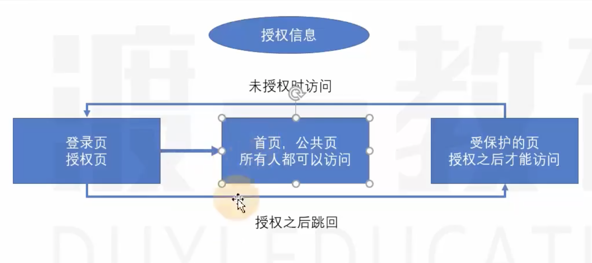

### 常见应用-受保护的页面

1. 应用场景

    1. 受保护的页面例如：需要登录才能访问的页面等

    2. 常见的有3种模式：

        

        1. 最初访问的是登录页，-》登录成功后跳转到公共页面
        2. 最初访问的是受保护的页面， -》自动跳转到登录页
        3. 登录页登录成功后， -》跳转到受保护的页面

2. 代码说明

    1. 准备好模拟页面组件: 普通的跳转

        ```jsx
        import React from "react";
        
        export default function Home() {
          return (
            <div>
              <h1>Home公共页</h1>
            </div>
          );
        }
        ```
        
        ```jsx
        import React from "react";
        
        export default function Info() {
          return (
            <div>
              <h1>受保护页</h1>
              <p>访问此页面，表名已登录成功！</p>
            </div>
          );
        }
        ```
        
        ```jsx
        import React from "react";
        
        export default function Login() {
          return (
            <div>
              <h1>登录页</h1>
              <p>只是个测试页面，点击按钮表示登录</p>
              <button>登录</button>
            </div>
          );
        }
        ```
        
        ```jsx
        import React from "react";
        import "./App.css";
        import {BrowserRouter as Router,Route,Link,Switch,Redirect} from "react-router-dom";
        import Login from "./pages/Login";
        import Info from "./pages/Info";
        import Home from "./pages/Home";
        
        export default function App() {
          return (
            <Router>
              <div className="container">
                {/* 链接区*/}
                <ul>
                  <li><Link to="/login">登录</Link></li>
                  <li><Link to="/">首页</Link></li>
                  <li><Link to="/info">个人信息</Link></li>
                </ul>
                {/* 内容区 */}
                <div className="box">
                  <Switch>
                    <Route path="/login" component={Login} />
                    <Route path="/info" component={Info} />
                    <Route path="/" component={Home} />
                  </Switch>
                </div>
              </div>
            </Router>
          );
        }
        ```
        
    1. 模式一：登录页点击登入，登录成功跳转到首页（公共页）

        ```jsx
        import React from "react";
        import loginData from "../loginData";
        
        export default function Login(props) {
          return (
            <div>
              <h1>登录页</h1>
              <p>只是个测试页面，点击按钮表示登录</p>
              <button
                onClick={() => {
                  loginData.login();
                  // 使用history对象的push方法实现跳转
                  loginData.isLogin? props.history.push("/"): alert("Please login again");}}
                  >登录 </button>
            </div>
          );
        }
        ```
        
        
        
    1. 模式二：保护页路径未登录时跳转到登录页

        使用自定义路由组件：根据不同的路径，展示（显然不同的组件）
        
        ```jsx
        import React from "react";
        import { Route, Redirect } from "react-router-dom";
        import loginData from "../loginData";
        
        export default function ProtectRoute({component: Component, chilren, render, ...rest}) {
          return (
            <Route
              //  除去component，chilren，render之外的所以参数传递过去
              {...rest}
              // render和children的区别：render匹配后才运行渲染，而children无论匹配与否都会运行
              render={() => {
                if (loginData.isLogin) {
                  // 如果授权成功，直接渲染这个组件
                  return <Component />;
                } else {
                  // 如果未授权（未登录）- 返回登录页
                  return <Redirect to="/login" />;
                }
              }}
            />
          );
        }
        ```
        
        ```jsx
         ...
        {/* 内容区 */}
                <div className="box">
                  <Switch>
                    <Route path="/login" component={Login} />
                    <ProtectRoute path="/info" component={Info} />
                    <Route path="/" component={Home} />
                  </Switch>
                </div>
        ...
        ```
        
    1. 模式三： 登录成功后跳转到保护层

        旧方法：利用`<Redirect to="/login" />`时传递一个地址栏参数(登录时地址栏能看到某些参数)
        
        ```jsx
        export default function ProtectRoute({component: Component, chilren, render, ...rest}) {
          return (
            <Route
           ...
                else {
                  // 如果未授权（未登录）- 返回登录页
                  return (
                    <Redirect
                      to={{
                        pathname: "/login",
                        search: "?returnUrl=" + location.pathname,
                      }}
                    />
              ...
          );
        }
        ```
        
        ```jsx
        ...
        import qs from "query-string";
        
        export default function Login(props) {
          return (
            <div>
           ...
              <button
                onClick={() => {
                  loginData.login();
                  const query = qs.parse(props.location.search);
                  // 使用history对象的push方法实现跳转
                  query.returnUrl
                    ? props.history.push(query.returnUrl)
                    : props.history.push("/");
                }}
              >
                登录
              </button>
            </div>
          );
        }
        
        ```
        
        
        
        新方法：使用historyAPI （登录时地址不显示携带的参数）
        
         ```jsx
          // 方法二：使用historyAPI的state属性
                     <Redirect
                       to={{
                         pathname: "/login",
                         state: location.pathname,
                       }}
                     />
                   );
         ```
        
        ```jsx
        import React from "react";
        import loginData from "../loginData";
        
        export default function Login(props) {
          return (
            <div>
              <h1>登录页</h1>
              <p>只是个测试页面，点击按钮表示登录</p>
              <button
                onClick={() => {
                  loginData.login();
                  // 方法二：
                  props.location.state
                    ? props.history.push(props.location.state)
                    : props.history.push("/");
                }}
              >
                登录
              </button>
            </div>
          );
        }
        
        ```
        
        
        
        


