# 导航守卫

导航守卫：当离开一个页面，进入另一个页面时，触发的事件

1. 准备代码

    ```jsx
    import React from "react";
    import "./App.css";
    import { BrowserRouter as Router, Route, Link, Switch } from "react-router-dom";
    
    function Page1() {
      return <div>Page1</div>;
    }
    
    function Page2() {
      return <div>Page2</div>;
    }
    
    export default function App() {
      return (
        <Router>
          <div className="container">
            <ul>
              <li><Link to="/page1">Page1</Link></li>
              <li><Link to="/page2">Page2</Link></li>
            </ul>
            <div className="box">
              <Switch>
                <Route path="/page1" component={Page1} />
                <Route path="/page2" component={Page2} />
              </Switch>
            </div>
          </div>
        </Router>
      );
    }
    ```

    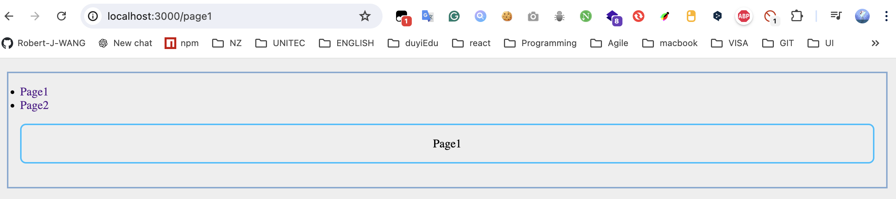

2. 自定义RouterGuard组件，使用高阶路由组件withRouter包裹（注入路由上下文history对象），使用此组件

    ```jsx
    import React, { Component } from "react";
    import { withRouter } from "react-router-dom";
    
    class RouterGuard extends Component {
      render() {
        return <div>{this.props.children}</div>;
      }
    }
    
    export default withRouter(RouterGuard);
    ```

    ```jsx
    export default function App() {
      return (
        <Router>
          <div className="container">
            <ul>
           ...
            </ul>
            <RouterGuard>
              <div className="box">
                <Switch>
                  <Route path="/page1" component={Page1} />
                  <Route path="/page2" component={Page2} />
                </Switch>
              </div>
            </RouterGuard>
          </div>
        </Router>
      );
    }
    ```

    

3. 探讨history对象的高级事件

​	history对象提供2个高级事件：listen和block，用来监听路径地址的变化

- listen: 添加一个监听器，监听地址的变化，当地址发生变化时，会调用传递的函数
  
  ```jsx
  class RouterGuard extends Component {
    componentDidMount() {
      this.props.history.listen(() => {
        console.log("地址变化了！！");
      });
    }
    render() {
      return <div>{this.props.children}</div>;
    }
  }
  
  export default withRouter(RouterGuard);
  
  ```
  
  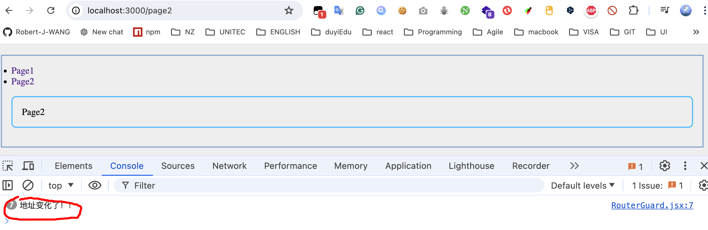
  
  - 参数：函数，运行时间点：发生在即将跳转到新页面时
    
    - 这个函数本身的参数：
    
    - 参数1：location对象，记录当前的地址信息
    
    - 参数2：action，一个字符串，表示进入该地址的方式
      - POP：出栈
        - 通过点击浏览器后退、前进
        - 调用history.go
        - 调用history.goBack
        - 调用history.goForward
      - PUSH：入栈
        - history.push
      - REPLACE：替换
        - history.replace
    
      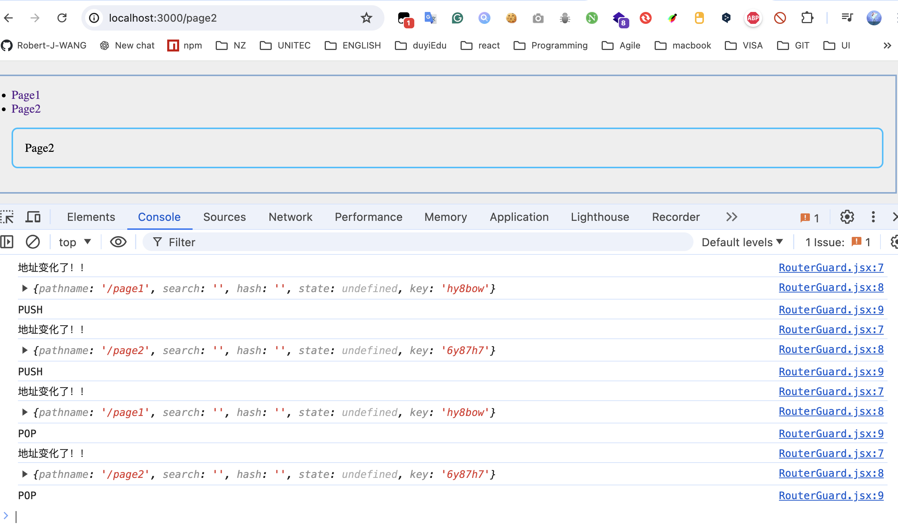
    
  - 返回结果：函数，可以调用该函数取消监听
  
  - 说明：
  
      - 监听到地址变化后，做什么事情呢？由于RouterGuard组件是一个自定义的通用组件，所以此组件不会制定监听之后的具体的动作，需要使用此组件是传递一个事件属性（定义了不同的动作）
  
          ```jsx
          export default function App() {
            return (
              <Router>
                <div className="container">
              ...
                  <RouterGuard
                    onChange={(prevLocation, locaction, action) =>
                      console.log(
                        `日志：路径变化了，路径从${prevLocation.pathname}跳转到${locaction.pathname}, 跳转的类型是:${action}`
                      )
                    }
                  >
                ...
                  </RouterGuard>
                </div>
              </Router>
            );
          }
          ```
  
          ```jsx
          class RouterGuard extends Component {
            componentDidMount() {
              // 当前的location对象就是监听地址路径变化之前的
              const prevLocation = this.props.history.location;
              this.props.history.listen((location, action) => {
                // 监听之后的location就是地址路径变化后新的
                // console.log("地址变化了！！");
                // console.log(location);
                // console.log(action);
                if (this.props.onChange) {
                  this.props.onChange(prevLocation, location, action);
                }
              });
            }
            render() {
              return <div>{this.props.children}</div>;
            }
          }
          
          export default withRouter(RouterGuard);
          ```
  
          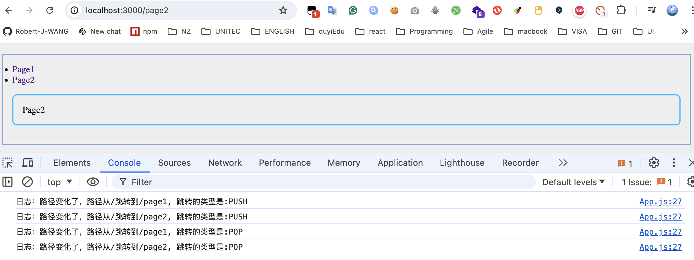
  
      - 取消监听，可以在组件卸载时取消，也可以把取消权限转交出去给使用者
  
          ```jsx
          class RouterGuard extends Component {
            componentDidMount() {
              const prevLocation = this.props.history.location;
              this.unListen = this.props.history.listen((location, action) => {
                if (this.props.onChange) {
                  // 将取消监听的权限交个使用者
                  this.props.onChange(prevLocation, location, action, this.unListen);
                }
              });
            }
            // 组件卸载时取消监听
            componentWillUnmount() {
              this.unListen();
            }
            render() {
              return <div>{this.props.children}</div>;
            }
          }
          
          export default withRouter(RouterGuard);
          ```
  
          ```jsx
          export default function App() {
            return (
              <Router>
                <div className="container">
               ...
                  <RouterGuard
                    onChange={(prevLocation, locaction, action, unListen) => {
                      count++;
                      console.log(
                        `count:${count},日志：路径变化了，路径从${prevLocation.pathname}跳转到${locaction.pathname}, 跳转的类型是:${action}`
                      );
                      if (count >= 5) {
                        console.log(`count:${count},日志：监听即将被取消`);
                        unListen();
                      }
                    }}
                  >
                  ...
                  </RouterGuard>
                </div>
              </Router>
            );
          }
          ```
  
          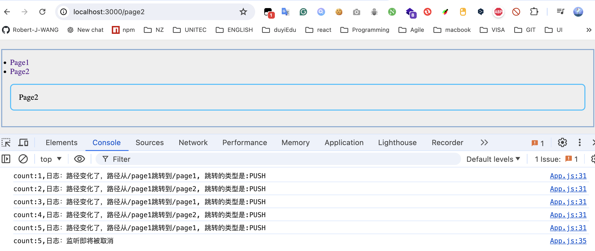
  
      - 监听器不能控制页面能不能跳转，想要设置页面的跳转，可以设置阻塞
  
- block：设置阻塞
  
  - 设置一个阻塞，并同时设置阻塞消息，页面跳转前会弹出阻塞消息
  
    ```jsx
    class RouterGuard extends Component {
      componentDidMount() {
        /* ---------------------- 1. 使用监听器 ---------------------- */
        const prevLocation = this.props.history.location;
        this.unListen = this.props.history.listen((location, action) => {
          if (this.props.onChange) {
            this.props.onChange(prevLocation, location, action, this.unListen);
          }
        });
    
        /* ---------------------- 2. 设置一个阻塞 --------------------- */
        this.props.history.block("真的要跳转页面吗？");
      }
      // 组件卸载时取消监听
      componentWillUnmount() {
        this.unListen();
      }
      render() {
        return <div>{this.props.children}</div>;
      }
    }
    ```
  
    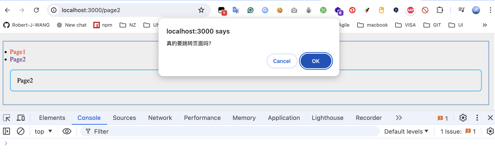
  
  - 当页面发生跳转时，会进入阻塞，并将阻塞消息传递到路由根组件的getUserConfirmation方法。
  
    ```jsx
    export default function App() {
      return (
        <Router
         getUserConfirmation={(msg) => {
            console.log(`想要跳转页面，没门！阻塞消息是：${msg}`);
          }}
        >
          <div className="container">
          ...
          </div>
        </Router>
      );
    }
    
    ```
  
    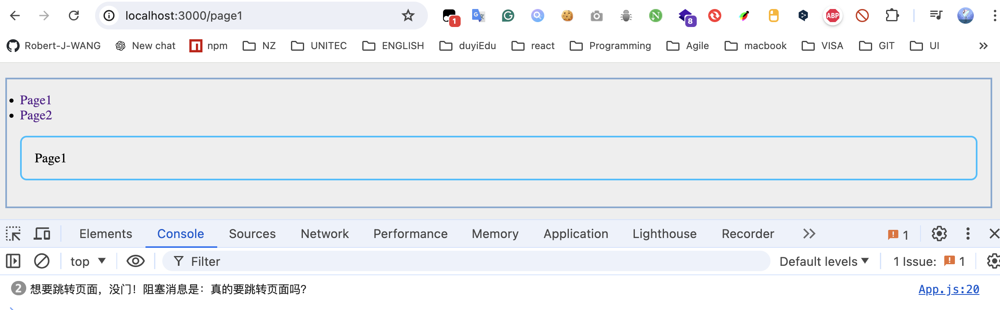
  
    说明：默认的是会弹出对话框，当自定义时（比如上面的` console.log("想要跳转页面，没门！");` ), 不会弹出对话框
  
  - 返回一个回调函数，用于取消阻塞器


路由根组件

- getUserConfirmation
  - 参数：函数
    - 参数1：阻塞消息
      - 字符串消息
      - 函数，函数的返回结果是一个字符串，用于表示阻塞消息
        - 参数1：location对象
        - 参数2：action值
      
    - 参数2：回调函数，调用该函数并传递true，则表示进入到新页面，否则，不做任何操作
    
        ```jsx
        export default function App() {
          return (
            <Router
            getUserConfirmation={(msg, callback) => {
                console.log(`想要跳转页面，没门！阻塞消息是：${msg}`);
                // 设置true - 可以调转
                callback(true);
                // 默认或者设置false - 不可以跳转
                callback(false);
              }}
            >
              <div className="container">
              ...
              </div>
            </Router>
          );
        }
        ```
    
        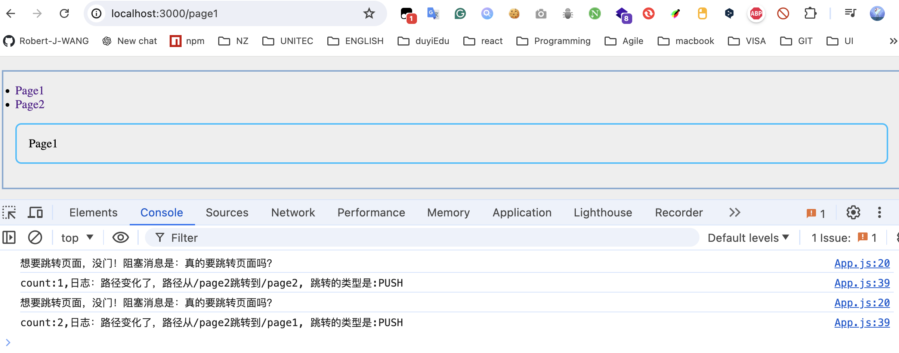


同时添加监听器和阻塞器

1. 重新调整组件结构（由于阻塞器函数getUserConfirmation在根路由中，需要将根路由<Router>组件从App移到自定义RouterGuard中

    ```jsx
    import React, { Component } from "react";
    import { BrowserRouter as Router, withRouter } from "react-router-dom";
    
    class RouterGuard extends Component {
      render() {
        return (
          <Router
          >
            {this.props.children}
          </Router>
        );
      }
    }
    
    export default RouterGuard;
    ```

    ```jsx
    ...
    export default function App() {
      return (
        <RouterGuard>
          <div className="container">
            <ul>
              <li>
                <Link to="/page1">Page1</Link>
              </li>
              <li>
                <Link to="/page2">Page2</Link>
              </li>
            </ul>
    
            <div className="box">
              <Switch>
                <Route path="/page1" component={Page1} />
                <Route path="/page2" component={Page2} />
              </Switch>
            </div>
          </div>
        </RouterGuard>
      );
    }
    
    ```

    

2. 由于RouterGuard包含根根路由<Router>组件，所以不能直接使用withRouter获取上下文对象

3. 自定义一个辅助组件_HelpRouter( 不返回任何内容)，专门用来使用withRouter获取上下文对象, 并添加阻塞消息

    ```jsx
    import React, { Component } from "react";
    import { BrowserRouter as Router, withRouter } from "react-router-dom";
    
    class _HelpRouter extends Component {
      componentDidMount() {
        /* ---------------------- 设置一个阻塞 --------------------- */
        this.props.history.block("真的要跳转页面吗？");
      }
      render() {
        return null;
      }
    }
    const HelpRouter = withRouter(_HelpRouter);
    
    class RouterGuard extends Component {
      render() {
        return (
          <Router
            getUserConfirmation={(msg) => {
              console.log(msg);
            }}
          >
            <HelpRouter />
            {this.props.children}
          </Router>
        );
      }
    }
    
    export default RouterGuard;
    ```

    

4. 将如何设置阻塞器跳转页面的权限交给使用者

    ```jsx
    import React, { Component } from "react";
    import { BrowserRouter as Router, withRouter } from "react-router-dom";
    
    class _HelpRouter extends Component {
      componentDidMount() {
        /* ---------------------- 设置一个阻塞 --------------------- */
        this.props.history.block("真的要跳转页面吗？");
      }
      render() {
        return null;
      }
    }
    const HelpRouter = withRouter(_HelpRouter);
    
    class RouterGuard extends Component {
      handleChange = (callback) => {
        this.props.onBeforeChange && this.props.onBeforeChange(callback);
      };
      render() {
        return (
          <Router
            getUserConfirmation={(msg, callback) => {
              this.handleChange(callback);
            }}
          >
            <HelpRouter />
            {this.props.children}
          </Router>
        );
      }
    }
    
    export default RouterGuard;
    ```

    ```jsx
    ...
    export default function App() {
      return (
        <RouterGuard
          onBeforeChange={(callback) => {
            console.log(`想要跳转页面`);
            callback(true);
          }}
        >
       ...
        </RouterGuard>
      );
    }
    ```

    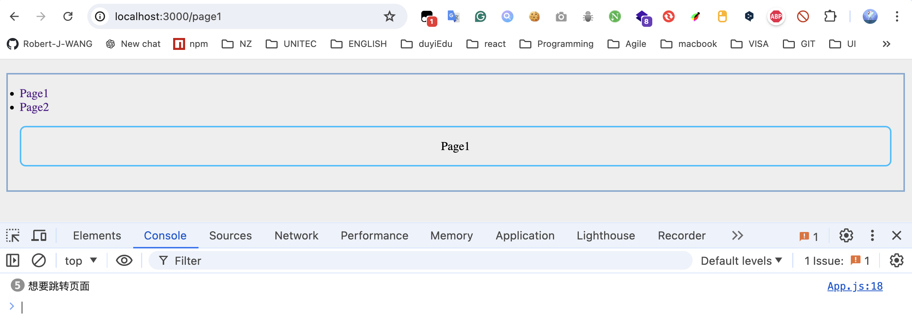

5. 对于设置阻塞消息block，参数也可以是一个函数，这个参数函数自身也有2个参数location和action

    ```jsx
    class _HelpRouter extends Component {
      componentDidMount() {
        /* ---------------------- 设置一个阻塞 --------------------- */
        this.props.history.block((location, action) => {
          console.log(location);
          console.log(action);
          return "真的要跳转页面吗？";
        });
      }
      render() {
        return null;
      }
    }
    const HelpRouter = withRouter(_HelpRouter);
    ```

    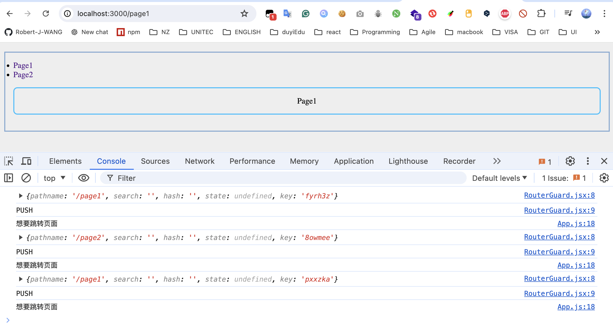

6. 如何将这些上下文对象传递给使用者？？- 使用全局变量保存，再传递

    ```jsx
    let prevLocation, location, action;
    
    class _HelpRouter extends Component {
      componentDidMount() {
        /* ---------------------- 设置一个阻塞 --------------------- */
        this.props.history.block((loc, ac) => {
          prevLocation = this.props.location;
          location = loc;
          action = ac;
          return "真的要跳转页面吗？";
        });
      }
    ...
    }
    const HelpRouter = withRouter(_HelpRouter);
    
    class RouterGuard extends Component {
      handleChange = (callback) => {
        this.props.onBeforeChange &&
          this.props.onBeforeChange(prevLocation, location, action, callback);
      };
      render() {
        return (
        ...
        );
      }
    }
    ```

    ```jsx
     <RouterGuard
          onBeforeChange={(prevLoc, curLoc, action, callback) => {
            console.log(
              `想要跳转页面: 从页面${prevLoc.pathname}跳转到${curLoc.pathname},跳转方式是${action} `
            );
            callback(true);
          }}
        >
    ...
        </RouterGuard>
    ```

    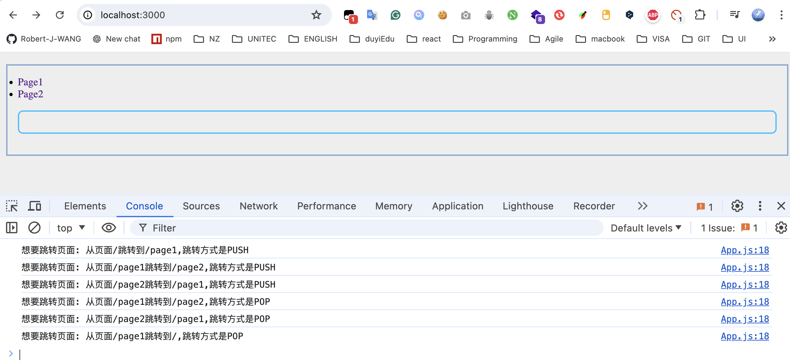

7. block返回一个回调函数，用于取消阻塞器

    ```jsx
    let prevLocation, location, action, unblock;
    
    class _HelpRouter extends Component {
      componentDidMount() {
        /* ---------------------- 设置一个阻塞 --------------------- */
        unblock = this.props.history.block((loc, ac) => {
          prevLocation = this.props.location;
          location = loc;
          action = ac;
          return "真的要跳转页面吗？";
        });
      }
      // 组件卸载-取消阻塞
      componentWillUnmount() {
        this.unblock();
      }
      render() {
        return null;
      }
    }
    const HelpRouter = withRouter(_HelpRouter);
    
    class RouterGuard extends Component {
      handleChange = (callback) => {
        if (this.props.onBeforeChange) {
          this.props.onBeforeChange(
            prevLocation,
            location,
            action,
            callback,
            unblock
          );
        } else {
          callback(true);
        }
      };
      render() {
        return (
          ...
        );
      }
    }
    
    export default RouterGuard;
    
    ```

    ```jsx
    let count = 0;
    ...
    export default function App() {
      return (
        <RouterGuard
          onBeforeChange={(prevLoc, curLoc, action, callback, unblock) => {
            count++;
            console.log(
              `count:${count},想要跳转页面: 从页面${prevLoc.pathname}跳转到${curLoc.pathname},跳转方式是${action} `
            );
            callback(true);
            // 设置取消阻塞的条件
            if (count === 5) {
              console.log(`count是5，取消阻塞 `);
              unblock();
            }
          }}
        >
          <div className="container">
          ...
          </div>
        </RouterGuard>
      );
    }
    ```

    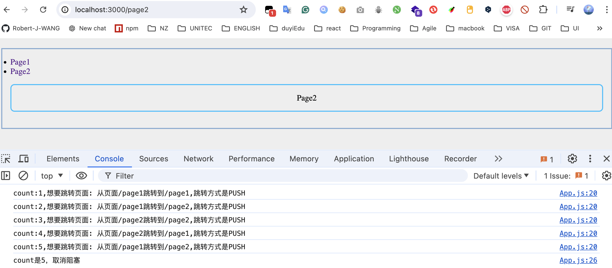

8. 添加监听器

    ```jsx
    let prevLocation, location, action, unblock;
    
    class _HelpRouter extends Component {
      componentDidMount() {
        /* ---------------------- 1. 设置一个阻塞 --------------------- */
        unblock = this.props.history.block((loc, ac) => {
          prevLocation = this.props.location;
          location = loc;
          action = ac;
          return "真的要跳转页面吗？";
        });
    
        /* ---------------------- 2. 添加监听器 ---------------------- */
        // 当前的location对象就是监听地址路径变化之前的
        this.unListen = this.props.history.listen((location, action) => {
          if (this.props.onChange) {
            // 将取消监听的权限交个使用者
            this.props.onChange(prevLocation, location, action, this.unListen);
          }
        });
      }
      // 组件卸载
      componentWillUnmount() {
        // 取消阻塞
        unblock();
        // 取消监听器
        this.unListen();
      }
      render() {
        return null;
      }
    }
    const HelpRouter = withRouter(_HelpRouter);
    
    class RouterGuard extends Component {
      ...
      };
      render() {
        return (
          <Router
            getUserConfirmation={(msg, callback) => {
              this.handleChange(callback);
            }}
          >
            <HelpRouter onChange={this.props.onChange} />
            {this.props.children}
          </Router>
        );
      }
    }
    
    export default RouterGuard;
    
    ```

    ```jsx
       <RouterGuard
          onBeforeChange={(prevLoc, curLoc, action, callback, unblock) => {
            console.log(
              `阻塞器日志：想要跳转页面: 从页面${prevLoc.pathname}跳转到${curLoc.pathname},跳转方式是${action} `
            );
            callback(true);
            // 设置取消阻塞的条件
            unblock();
          }}
          onChange={(prevLocation, locaction, action, unListen) => {
            console.log(
              `监听器日志：路径变化了，路径从${prevLocation.pathname}跳转到${locaction.pathname}, 跳转的类型是:${action}`
            );
            unListen();
          }}
        >
    ```

    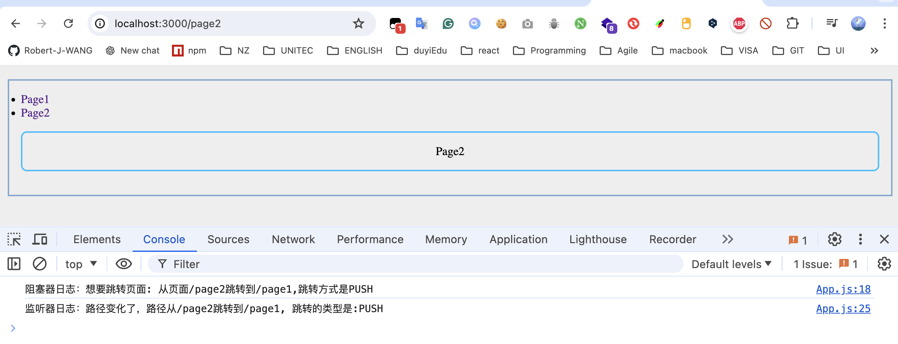

9. 基本流程图

    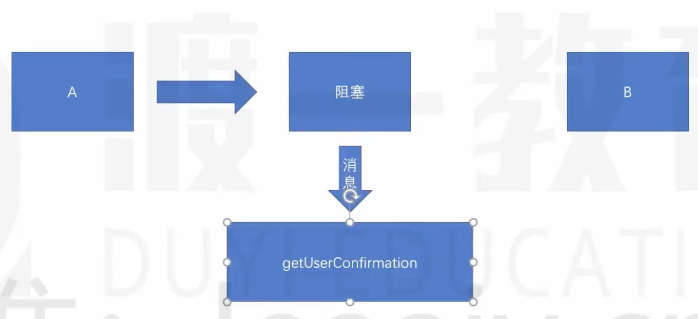

    