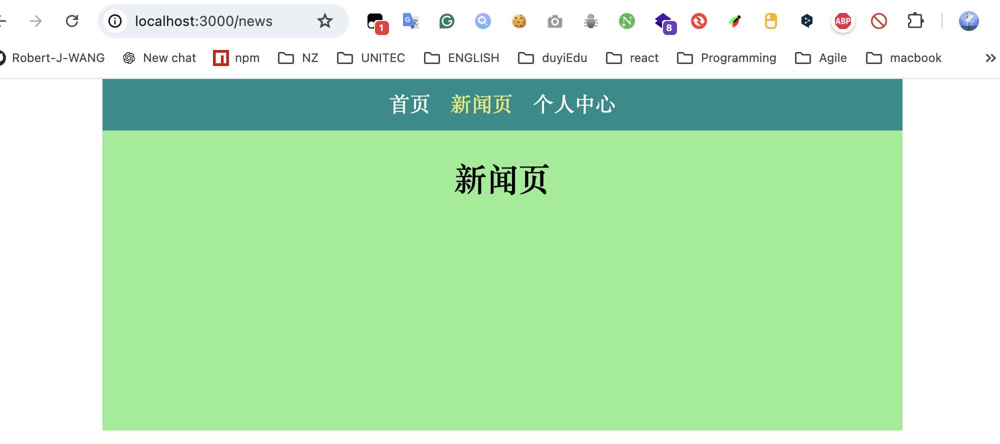
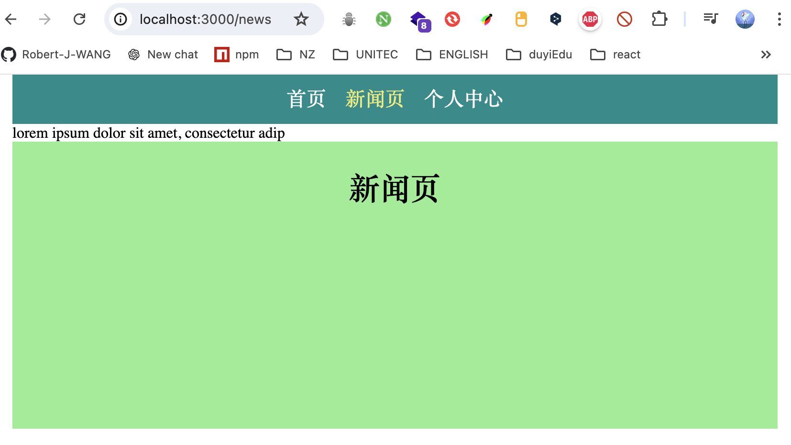
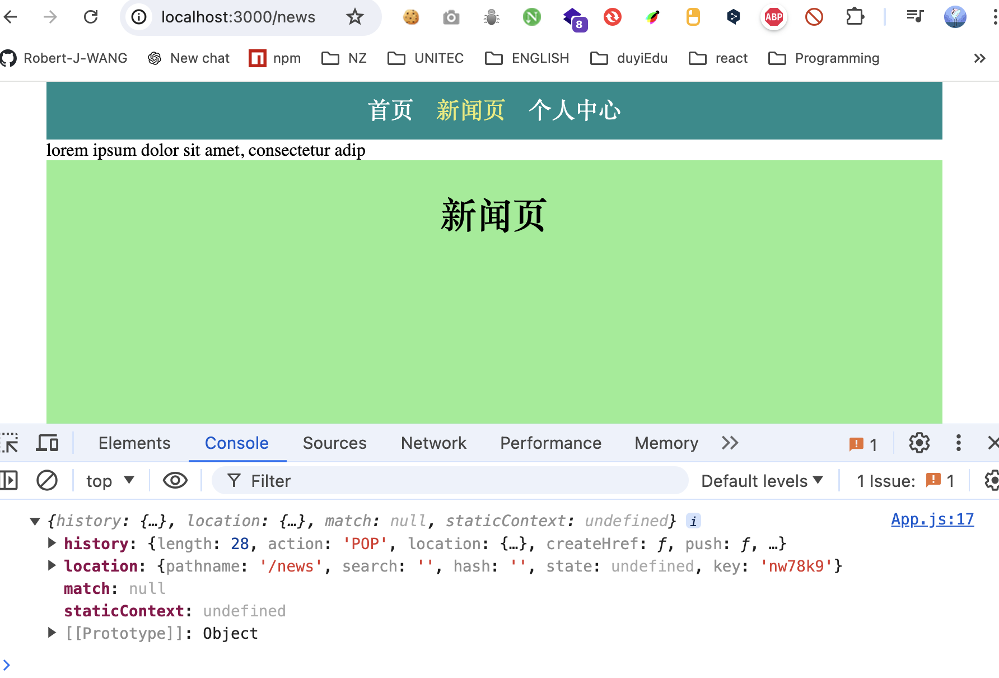
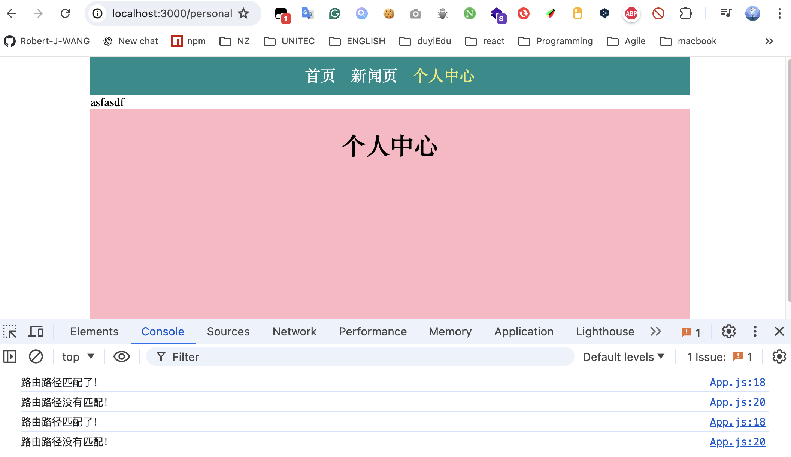
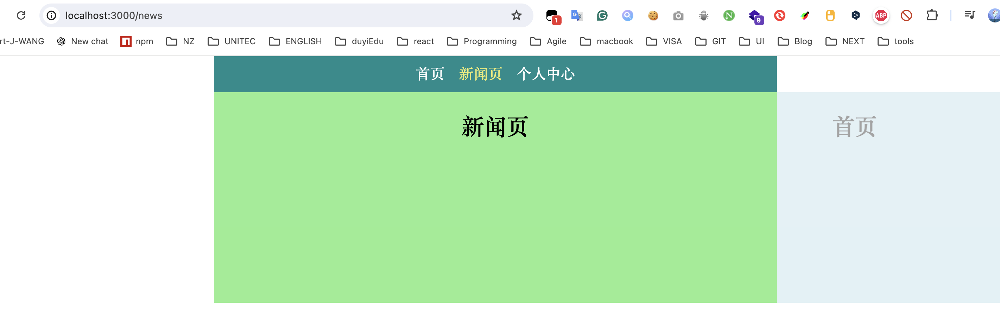

# 路由切换动画

切换页面时，使用第三方库react-transition-group 的CSSTransition 和animate.css库实现动画

1. 准备代码

    ```jsx
    import "./Pages.css";
    import React from "react";
    import { NavLink } from "react-router-dom";
    
    export function NavBar() {
      return (
        <div className="header">
          <NavLink to="/" exact>首页</NavLink>
          <NavLink to="/news" exact>新闻页</NavLink>
          <NavLink to="/personal" exact>个人中心</NavLink>
        </div>
      );
    }
    
    export function Home() {
      return (
        <div className="page home">
          <h1>首页</h1>
        </div>
      );
    }
    
    export function News() {
      return (
        <div className="page news">
          <h1>新闻页</h1>
        </div>
      );
    }
    
    export function Personal() {
      return (
        <div className="page personal">
          <h1>个人中心</h1>
        </div>
      );
    }
    
    ```

    ```jsx
    import React from "react";
    import * as Pages from "./Pages";
    import { BrowserRouter as Router, Route } from "react-router-dom";
    import "./App.css";
    
    export default function App() {
      return (
        <div className="main">
          <Router>
            <Pages.NavBar></Pages.NavBar>
            <div className="page-container">
              <Route path="/" exact component={Pages.Home} />
              <Route path="/news" exact component={Pages.News} />
              <Route path="/personal" exact component={Pages.Personal} />
            </div>
          </Router>
        </div>
      );
    }
    ```

    

2. 分析需求：当地址路径变化时，旧的页面也要加载（通过动画让其消失）。 

    Route组件的component和render属性：需要路由路径完全匹配是才会加载。

    Route组件的children属性： 不管路由路径是不是匹配都会加载

    1. children属性值可以是字符串

    ```jsx
    export default function App() {
      return (
        <div className="main">
          <Router>
            <Pages.NavBar />
            <div className="page-container">
              <Route path="/" exact>
                lorem ipsum dolor sit amet, consectetur adip
              </Route>
              <Route path="/news" exact component={Pages.News} />
              <Route path="/personal" exact component={Pages.Personal} />
            </div>
          </Router>
        </div>
      );
    }
    ```

    

    2. children属性值也可以是一个函数，并且次函数的参数就是当前的上下文history对象，可以返回对应的组件

    ```jsx
    export default function App() {
      return (
        <div className="main">
          <Router>
            <Pages.NavBar />
            <div className="page-container">
              <Route path="/" exact>
              {/*1. children属性可以是字符串 */}
              {/* lorem ipsum dolor sit amet, consectetur adip */}
              {/* 2. children属性也可以是一个函数，返回字符串或者组件  */}
                {(history) => {
                  console.log(history);
                  return "lorem ipsum dolor sit amet, consectetur adip";
                }}
              </Route>
           ...
            </div>
          </Router>
        </div>
      );
    }
    ```

    

3. 路由路径匹配时，match对象有值，不匹配是match为null。 

    ```jsx
    export default function App() {
      return (
        <div className="main">
          <Router>
            <Pages.NavBar />
            <div className="page-container">
              <Route path="/" exact>
                {({ match }) => {
                  if (match) {
                    console.log("路由路径匹配了！");
                  } else {
                    console.log("路由路径没有匹配！");
                  }
                  return "asfasdf";
                }}
              </Route>
             ...
            </div>
          </Router>
        </div>
      );
    }
    ```

    

4. 因此，可以判断match是否为空（路由路径有没有匹配）来控制CSSTransition组件的进入退出的开关（in 属性）

    使用CSSTransition组件，配置动画属性

    ```jsx
    ...
    import { CSSTransition } from "react-transition-group";
    import "animate.css";
    
    export default function App() {
      return (
        <div className="main">
          <Router>
            <Pages.NavBar />
            <div className="page-container">
              <Route path="/" exact>
                {({ match }) => {
                  return (
                    <CSSTransition
                      in={match ? true : false}
                      timeout={3000}
                    classNames={{
                  	enter: "animate__animated slower animate__fadeInLeft",
                  	exit: "animate__animated slower animate__fadeOutRight",
                }}
                      // 当进入（in=ture）是挂载内部的子组件
                      mountOnEnter={true}
                      // 当退出（in=false）时卸载内部的子组件
                      unmountOnExit={true}
                    >
                      {Pages.Home}
                    </CSSTransition>
                  );
                }}
              </Route>
         ...
            </div>
          </Router>
        </div>
      );
    }
    ```

    

5. 封装通用的动画路由组件, 并使用

    ```jsx
    import React from "react";
    import { Route } from "react-router-dom";
    import { CSSTransition } from "react-transition-group";
    import "animate.css";
    
    export default function AnimationRoute({
      component: Component,
      children,
      ...rest
    }) {
      return (
        <Route {...rest}>
          {({ match }) => {
            return (
              <CSSTransition
                in={match ? true : false}
                timeout={3000}
                classNames={{
                  enter: "animate__animated slower animate__fadeInLeft",
                  exit: "animate__animated slower animate__fadeOutRight",
                }}
                // 当进入（in=ture）是挂载内部的子组件
                mountOnEnter={true}
                // 当退出（in=false）时卸载内部的子组件
                unmountOnExit={true}
              >
                {Component}
              </CSSTransition>
            );
          }}
        </Route>
      );
    }
    
    ```

    ```jsx
    import React from "react";
    import * as Pages from "./Pages";
    import { BrowserRouter as Router } from "react-router-dom";
    import "./App.css";
    import AnimationRoute from "./AnimationRoute";
    
    export default function App() {
      return (
        <div className="main">
          <Router>
            <Pages.NavBar />
            <div className="page-container">
              <AnimationRoute path="/" exact component={Pages.Home} />
              <AnimationRoute path="/news" exact component={Pages.News} />
              <AnimationRoute path="/personal" exact component={Pages.Personal} />
            </div>
          </Router>
        </div>
      );
    }
    
    ```

    

6. 特别注意：<AnimationRoute>外部不能再使用Switch组件包裹

    因为使用Switch后，路径配到到一个之后，就不在匹配其他的组件，这导致其他的组件不让渲染，从而导致动画效果失效

