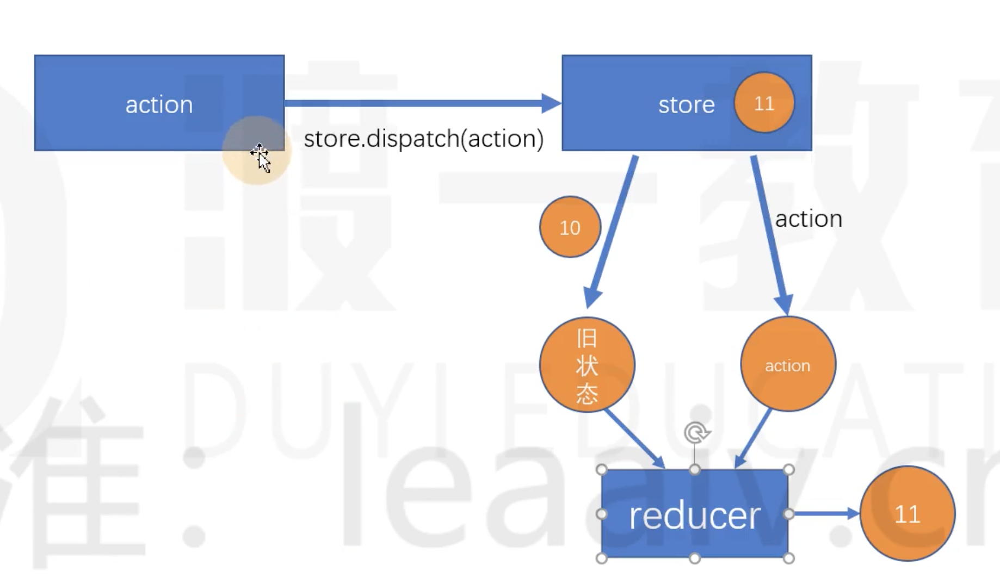

## 使用Redux管理数据

### redux 安装和基础使用

1. redux 安装

    ```
    yarn add redux
    ```

2. 配置使用：原本可以独立使用，为了切合实际开发需求，直接在之前的react-learn项目中使用

    - 创建新的文件夹redux，新建文件index.js
    - 主文件index.js中引入上面的文件
    - 新的index.js中编写redux相关的代码

### redux初体验

1. reducer 介绍

    - reducer本身就是一个普通函数：其有2个属性和一个返回值
    - 属性1：state -》仓库store中原先的状态（数据）
    - 属性2： action -》描述要做什么的一个对象
    - 返回值： 返回新的状态（数据）

2. 举例

    - 假设仓库中只有一个状态（数据），一个数字

    - 这个数字可能+1， 也可能－1，

    - 约定 action的编写格式为：

        ​	{

        ​		type: 改变状态的描述

        ​		payload: 改变状态时的附加信息

        ​	}

    - 代码体验：

        ```js
        /**
         * reducer本身就是一个普通函数
         * @param {*} state 之前仓库store中的状态（数据）
         * @param {*} action 描述要做什么的对象
         * @returns 返回新的状态state
         */
        function reducer(state, action) {
          // 本身要返回新的状态（数据）
          if (action.type === "increment") {
            return state + 1;
          } else if (action.type === "decrement") {
            return state - 1;
          } else return state;
        }
        ```

    - **注意：redux并不提供reducer函数，reducer函数需要自己创建（具体处理数据的细节需求各不相同）**

3. 状态仓库store

    - redux提供了状态仓库store

    - 使用createStore方法创建

    - 需要传递2个参数：reducer，初始状态值

    - 代码举例：

        ```js
        import { legacy_createStore as createStore } from "redux";
        ...
        /* ------- 2. 使用redux提供的数据仓库store（使用createStore方法） ------ */
        const store = createStore(reducer, 10); // store里的初始状态设为10
        console.log(store.getState()); // 10 查看状态的初始值
        ```

4. 创建一个action对象

    - 按照约定的格式

        ```js
        /* --------------------- 3. 创建一个action对象 -------------------- */
        const action = {
          type: "increment",
          payload: "",
        };
        ```

5. 将action对象分发给reducer，进行状态数据的操作，并自动更新仓库里的状态数据

    - 使用store的dispatch方法

        ```js
        /* ----------------- 4. 分发action给reducer ---------------- */
        store.dispatch(action);
        ```

6. 测试仓库中的状态数据是否更新更改

    - 使用store的**getState**()方法

        ```
        /* ------------------- 5.测试state是否更新成功 ------------------ */
        console.log(store.getState()); // 11 更新成功	
        ```

7. store工作原理图

    

8. 最终完整的体验代码

    ```js
    import { legacy_createStore as createStore } from "redux";
    
    /* -------------------- 1. 自定义reducer ------------------- */
    /**
     * reducer本身就是一个普通函数
     * @param {*} state 之前仓库store中的状态（数据）
     * @param {*} action 描述要做什么的对象
     * @returns 返回新的状态state
     */
    function reducer(state, action) {
      // 本身要返回新的状态（数据）
      if (action.type === "increment") {
        return state + 1;
      } else if (action.type === "decrement") {
        return state - 1;
      } else return state;
    }
    
    /* ------- 2. 使用redux提供的数据仓库store（使用createStore方法） ------ */
    const store = createStore(reducer, 10); // store里的初始状态设为10
    console.log(store.getState()); // 10 查看状态的初始值
    
    /* --------------------- 3. 创建一个action对象 -------------------- */
    const action = {
      type: "increment",
      payload: "",
    };
    /* ----------------- 4. 分发action给reducer ---------------- */
    store.dispatch(action);
    
    /* ------------------- 5.测试state是否更新成功 ------------------ */
    console.log(store.getState()); // 11 更新成功
    
    ```
