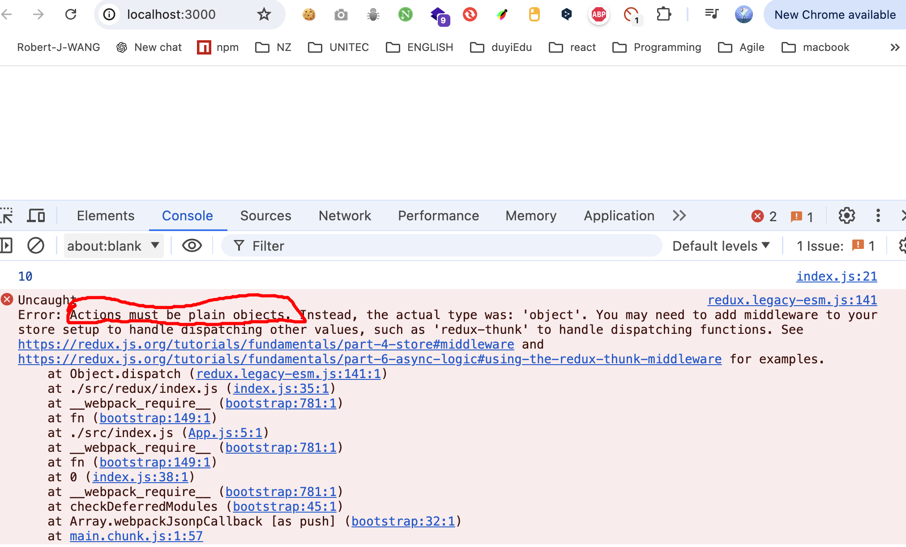

# Action

1. action是一个plain-object（平面对象）
   1. 它的__proto__指向Object.prototype - 就是一个最简单结构的对象（用字面量{ }创建的对象）

   2. 如果通过类创建的对象，会报错

       ```js
       ...
       
       /* --------------------- 3. 创建一个action对象 -------------------- */
       class Action {
         constructor(type) {
           this.type = type;
         }
       }
       const action = new Action("increment");
       ...
       ```

       

2. 通常，使用payload属性表示附加数据（没有强制要求）

3. action中必须有type属性，该属性用于描述操作的类型
   1. 但是，没有对type的类型做出要求

4. 在大型项目，由于操作类型非常多，为了避免硬编码（hard code），会将action的类型存放到一个或一些单独的文件中(样板代码)。

    1. 新建action文件夹，创建action-type文件：用于专门导出action类型

        ```js
        export const INCREMENT = "increment";
        export const DECREMENT = "decrement";
        ```

    2. 导入使用

        ```js
        import { legacy_createStore as createStore } from "redux";
        import * as actionTypes from "./action/action-type";
        
        /* -------------------- 1. 自定义reducer ------------------- */
        /**
         * reducer本身就是一个普通函数
         * @param {*} state 之前仓库store中的状态（数据）
         * @param {*} action 描述要做什么的对象
         * @returns 返回新的状态state
         */
        function reducer(state, action) {
          // 本身要返回新的状态（数据）
          if (action.type === actionTypes.INCREMENT) {
            return state + 1;
          } else if (action.type === actionTypes.DECREMENT) {
            return state - 1;
          } else return state;
        }
        
        /* ------- 2. 使用redux提供的数据仓库store（使用createStore方法） ------ */
        const store = createStore(reducer, 10); // store里的初始状态设为10
        console.log(store.getState()); // 10 查看状态的初始值
        
        /* --------------------- 3. 创建一个action对象 -------------------- */
        const action = {
          type: actionTypes.INCREMENT,
          payload: "",
        };
        /* ----------------- 4. 分发action给reducer ---------------- */
        store.dispatch(action);
        
        /* ------------------- 5.测试state是否更新成功 ------------------ */
        console.log(store.getState()); // 11 更新成功
        
        ```

        

5. 为了方面传递action，通常会使用action创建函数(action creator)来创建action

   1. 新建文件number-action.js

       ```js
       import * as actionTypes from "./action-type";
       
       export const getIncreaseAction = () => ({
         type: actionTypes.INCREMENT,
       });
       
       export const getDecreaseAction = () => ({
         type: actionTypes.DECREMENT,
       });
       
       export const getSetAction = (newNumber) => ({
         type: actionTypes.SET,
         payload: newNumber,
       });
       
       ```

   2. 使用action creator得到需要的action

       ```js
       import { legacy_createStore as createStore } from "redux";
       import * as actionTypes from "./action/action-type";
       import * as numberActions from "./action/number-action";
       
       function reducer(state, action) {
         // 本身要返回新的状态（数据）
         if (action.type === actionTypes.INCREMENT) {
           return state + 1;
         } else if (action.type === actionTypes.DECREMENT) {
           return state - 1;
         } else if (action.type === actionTypes.SET) {
           return action.payload;
         } else return state;
       }
       
       /* ------- 2. 使用redux提供的数据仓库store（使用createStore方法） ------ */
       const store = createStore(reducer, 10); // store里的初始状态设为10
       console.log(store.getState()); // 10 查看状态的初始值
       
       /* ----------------- 4. 分发action给reducer ---------------- */
       store.dispatch(numberActions.getIncreaseAction());
       
       /* ------------------- 5.测试state是否更新成功 ------------------ */
       console.log(store.getState()); // 11 更新成功
       
       /* ----------------- 4. 分发action给reducer ---------------- */
       store.dispatch(numberActions.getSetAction(99));
       
       /* ------------------- 5.测试state是否更新成功 ------------------ */
       console.log(store.getState()); // 99 更新成功
       
       ```

       

   3. 注意事项：action创建函数应为无副作用的纯函数

       1. 不能以任何形式改动参数
       2. 不可以有异步
       3. 不可以对外部环境中的数据造成影响

6. 为了方便利用action创建函数来分发（触发）action，redux提供了一个函数```bindActionCreators```，该函数用于增强action创建函数的功能，使它不仅可以创建action，并且创建后会自动完成分发。

    bindActionCreators()需要传递2个参数：

    1. 所有action合并后的对象

    2. store的dispatch方法

    3. bindActionCreators()返回的是和第一个参数具有相同属性的对象，但已经注入了自动分发dispatch的功能

    4. 直接引入并使用

        ```js
        import { legacy_createStore as createStore, bindActionCreators } from "redux";
        import * as actionTypes from "./action/action-type";
        import * as numberActions from "./action/number-action";
        
        /* -------------------- 1. 自定义reducer ------------------- */
        function reducer(state, action) {
          // 本身要返回新的状态（数据）
          if (action.type === actionTypes.INCREMENT) {
            return state + 1;
          } else if (action.type === actionTypes.DECREMENT) {
            return state - 1;
          } else if (action.type === actionTypes.SET) {
            return action.payload;
          } else return state;
        }
        
        /* ------- 2. 使用redux提供的数据仓库store（使用createStore方法） ------ */
        const store = createStore(reducer, 10); // store里的初始状态设为10
        console.log(store.getState()); // 10 查看状态的初始值
        
        // 6. 为了方便利用action创建函数来分发（触发）action，redux提供了一个函数```bindActionCreators```，该函数用于增强action创建函数的功能，使它不仅可以创建action，并且创建后会自动完成分发。
        // bindActionCreators()需要传递2个参数：
        // 1. 所有action合并后的对象
        // 2. store的dispatch方法
        // bindActionCreators()返回的是和第一个参数具有相同属性的对象，但已经注入了dispatch：
        const bindNumberActions = bindActionCreators(numberActions, store.dispatch);
        bindNumberActions.getIncreaseAction();
        console.log(store.getState()); // 100 更新成功
        bindNumberActions.getDecreaseAction();
        console.log(store.getState()); // 99 更新成功
        bindNumberActions.getSetAction(999);
        console.log(store.getState()); // 999 更新成功
        
        ```

        