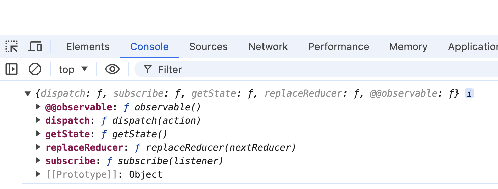

# Store

Store：用于保存数据

通过createStore方法创建的对象。

```js
...

/* ------- 1. 使用redux提供的数据仓库store（使用createStore方法） ------ */
const store = createStore(reducer); // 不设置初始状态，默认值为undefined
console.log(store);

...

```



该对象的成员：

- dispatch：分发一个action

- getState：得到仓库中当前的状态

- replaceReducer：替换掉当前的reducer (不常用，了解即可)

- subscribe：注册一个监听器，监听器是一个无参函数，该分发一个action之后，会运行注册的监听器。该函数会返回一个函数，用于取消监听

    ```js
    import { legacy_createStore as createStore, bindActionCreators } from "redux";
    import * as loginUserActions from "./action/loginUserAction";
    import { reducer } from "./reducer/index";
    
    /* ------- 1. 使用redux提供的数据仓库store（使用createStore方法） ------ */
    const store = createStore(reducer); // 不设置初始状态，默认值为undefined
    console.log(store);
    // 注册一个监听器
    const unSubscribe = store.subscribe(() => {
      console.log(`这是一个监听器!`);
    });
    // 可以注册多个监听器
    const newUnSubscribe = store.subscribe(() => {
      console.log(`这是一个新的监听器!`);
    });
    // 取消监听器
    unSubscribe();
    /* ----- 2.使用bindActionCreators函数创建增强版action，并自动完成分发 ---- */
    
    /* ------------------- 2.1 测试loginUser ------------------ */
    const bindLoginUserActions = bindActionCreators(
      loginUserActions,
      store.dispatch
    );
    const { getSetLoginUser } = bindLoginUserActions;
    getSetLoginUser({ username: "kate", password: "123456" });
    console.log(store.getState());
    
    ```

    