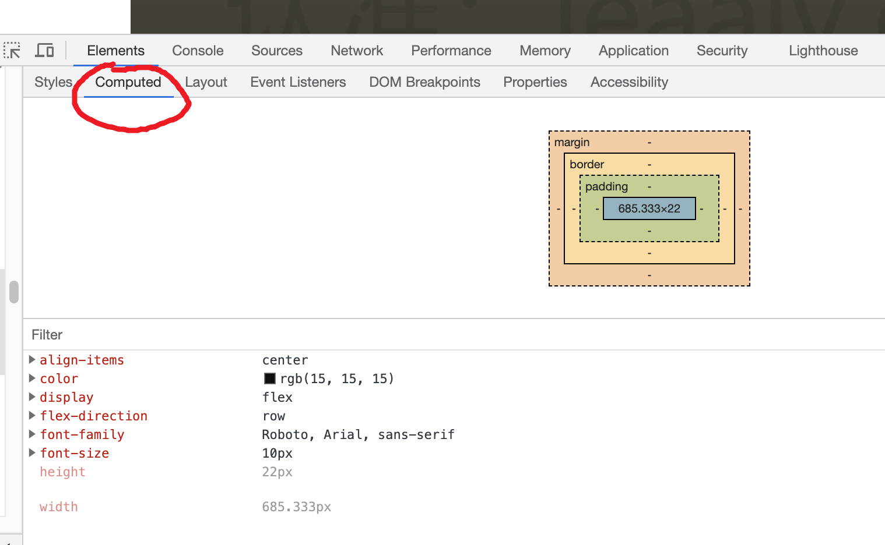
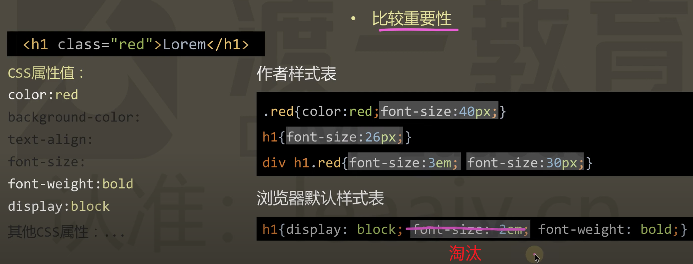

## 01 HTML+CSS收官

### [01. 补充重要知识](https://www.youtube.com/watch?v=m-47rcPYSXk)

1. 仿脱发神器：设置通用样式, 盒模型为border-box

    ```css
    * {
      margin: 0;
      padding: 0;
      box-sizing: border-box;
      /* 这样盒子的款和高尺寸将包含margin，padding以及border尺寸 */
    }
    .box {
      width: 200px;
      height: 200px;
      background-color: lightpink;
      margin: 20px;
      padding: 20px;
      border: 10px solid lightgreen;
      /* 外边框尺寸不参加计算 */
      outline: 1px solid ; 
    }
    /* 盒子内容的实际尺寸是140px x 140px */
    ```

2.  颜色的alpha通道

    - 颜色的alpha通道标识了颜色的透明度，他是一个0~1之间的取值。0表示完全透明，1表示完全不透明
    - 在css中使用rgba为颜色添加alpha通道

    ```css
    .rgba{
      /* 使用alpha通道控制 */
      color: rgba(16, 72, 240, 0.5);
    
      /* 使用opacity控制 */
      /* color: rgb(11, 23, 242);
      opacity: 0.5; */
    }
    ```

    -   alpha通道 比opacity更精确;

    -  opacity控制整盒子，包括背景颜色和文字颜色
    -  rgba能控制单个属性。比如只控制文字颜色 */

3. 尺寸的百分比

    - 绝大部分可以书写尺寸的地方，都可以书写百分比
    - 百分比是一个相对单位，其相对与元素的**参考系**，比如：
    - **普通元素**的参考系：**父元素的内容区域**（不包含margin，padding，border）
    - **绝对（固定）定位元素**的参考系：父元素中**第一个定位元素的==包含padding区域==**
    - ==常见百分比的情况==

    | css属性 | 百分比相对于     | 备注                                                         |
    | ------- | ---------------- | ------------------------------------------------------------ |
    | Width   | 参考系的**宽度** |                                                              |
    | Height  | 参考系的**高度** | 参考系（父元素）高度受本身（这个子元素）宽度影响时，设置无效。只有父元素的高度不受这个子元素是否存在而影响时，才能给这个子元素使用百分比 |
    | Padding | 参考系的**宽度** | 不常用                                                       |
    | Margin  | 参考系的**宽度** | 不常用                                                       |
    | Border  | 参考系的**宽度** | 不常用                                                       |

4. 最大最小宽度

    - 最大宽度：max-width， 最大高度：max-height
    - 最小宽度：min-width，最小高度：min-height
    - 当一个元素的尺寸会自动变化时，设置最大最小宽高，可以让他不至于变的过小或者过大
    - 实际开发中，通常给PC端页面设置一个最小宽度，通常次宽度为设计稿的宽度

    ```css
    html{
      min-width: 1226px;
    }
    ```

    - 给页面中的所有图片设置一个最大宽度。让图片不超过容器

    ```css
    img{
      max-width: 100%;
    }
    ```

    

### [02. 表单进阶-HTML](https://www.youtube.com/watch?v=PKY5WT5P9NU)

1. 使用form标签代替div

    - form标签内置了表单的提交功能：点击提交按钮，或者enter键时，都会触发提交功能
    - 同时，会自动清空input表单域里填写的内容
    - 同时页面有刷新的动作，提示用户表单已经提交。
    - 使用div的话，需要通过js手动设置

2. 给表单元素多嵌套一层div

    - 用于统一设置每一项表单元素的通用样式, 比如 “form-item”

    ```html
    <div class="form-item">
          <input type="text" >
        </div>
    ```

3. 使用placeholder属性，设置提示文本

    ```html
    <div class="form-item">
          <input type="text" placeholder="请输入11位手机号">
     </div>
    ```

    

4. 使用maxlength属性，设置输入的最大长度

    ```html
     <div class="form-item">
          <input type="text" placeholder="请输入11位手机号" maxlength="11">
    </div>
    ```

    - 注意：需要输入的格式要使用js和正则表达式限制

5. 使用button标签代替 input type="buttont"

    - 更具语义化
    - 是一个正常标签，可以在其内部嵌套其他标签，用于设置格外的样式

    ```html
    <button>
            <!-- button内部可以嵌套其他标签 -->
            <span>发送验证码</span>
            <!-- 甚至可以嵌套图片 -->
            
    </button>
    ```

    

6. button标签类型设置

    - 默认是提交（submit）按钮
    - 一般一个表单只有一个提交按钮
    - 其他功能的按钮可以通过type属性来设置

    ```html
        <!--type="button" 为普通按钮 -->
    <button type="button">
            <span>发送验证码</span>
            <!-- 甚至可以嵌套图片 -->
            
    </button>
      <!--还有reset, menu等其他类型的按钮 -->
    
    ```

    

7. 表单的布尔属性

    - 布尔属性用来设置两种状态，添加属性，表示有这个状态，不写表示没有
    - 常见的布尔属性有：

    | 属性     | 标签                     | 状态                     |
    | -------- | ------------------------ | ------------------------ |
    | multiple | select下拉标签           | 下拉标签里的选项可以多选 |
    | selected | option选项标签           | 默认选中的               |
    | checked  | Input 单选/多选框        | 默认选中的               |
    | disabled | button按钮或Input 输入框 | 不可用                   |
    |          |                          |                          |

    - 一键生成多个标签快捷键

        1. 标签名\*个数>{标签内容$(自动编号)}

        ```html
         <select multiple>
              <option  selected value="">爱好1</option>
              <option value="">爱好2</option>
              <option value="">爱好3</option>
              <option value="">爱好4</option>  
         </select>
        ```

        2. 标签名\*个数>lorem4 (4个占位字符)

        ```html
          <select multiple>
            <option selected>Lorem, ipsum dolor.</option>
            <option>Hic, expedita commodi?</option>
            <option>Architecto, quia eveniet.</option>
            <option>Voluptates, quaerat vel.</option>
            <option>Harum, dicta omnis.</option>
          </select>
        ```

8. label标签的使用

    - 用途：点击文字内容是选中单选框或多选框

    - 方法：

        1. 使用label的for属性，配合单选框或多选框的id (label标签的文字内容不一定要和标签在一起)

        ```html
        <div class="form-item">
          <div>性别：</div>
          <div>
            <!--label使用 方法1： -->
            <input type="radio" name="sex" id="male" />
            <label for="male">男</label>
          </div>
        </div>
        ```

        

        2. 使用label标签包裹整个单选框/多选框及对应的文字 （推荐）

        ```html
        <div class="form-item">
          <div>性别：</div>
          <div>
            <!--label使用 方法2： -->
            <label >
              <input type="radio" name="sex" />
              <span>女</span>
            </label>
          </div>
        </div>
        ```

9. 多行文本textarea标签

    - 一般使用css设置宽高，不用属性cols**=**"30" rows**=**"10"来设置

    - css样式中使用{resize:none} 设置文本域不可以拉升

        

### [03. 表单进阶-CSS](https://www.youtube.com/watch?v=_bHQTzIvMpY)

1. 设置html通用样式

    ```css
    *{
      margin: 0;
      padding: 0;
      box-sizing: border-box;
    }
    html{
      background-color: #1c1e26;
      color: #333;
    }
    ```

2. 设置标题样式

    - text-align**:** **center**; 表示元素标签内容在容器里的居中
    - 标签内容可以是文字，也可以是图片，或者其他div盒子

    ```css
    /* 标题样式 */
    .container h1{
      /* outline: 1px solid ; */
      text-align: center;
      margin-bottom: 30px;
    }
    ```

    

3. 设置表单项通用样式

    - *去掉外边框* outline: none;
    - *input字体需要单独设置，不能继承html默认字体*
    - *单独设置input表单项聚焦时的样式*

    ```css
    /* 设置表单项通用样式 */
    .txt{
      /* 去掉外边框 */
      outline: none;
      border: 1px solid #ccc;
      width: 100%;
      height: 40px;
      margin-bottom: 10px;
      padding:0 10px;
      /* input字体需要单独设置，不能继承html默认字体 */
      font-size: 14px;
      border-radius: 5px;
    }
    /* input表单项聚焦时的样式 */
    .txt:focus{
      border: 1px solid #0a47f0;
    }
    
    ```

4. 设置特殊表单选样式

    - 标签名+类名（中间没有空格，表示并且）精确选中元素

    - 文本域设置不能拉伸

    ```css
    /* 设置表单特殊样式 */
    /* 下拉框 */
    select.txt{
      height: 100px;
      padding: 10px;
    }
    textarea.txt{
      height: 100px;
      padding: 10px;
      /* 不能拉伸 */
      resize: none;
    }
    ```

5. 设置按钮通用样式

    - 去掉默认的边框
    - 单独设置字体大小

    ```css
    /* 设置按钮通用样式 */
    button{
      width: 150px;
      height: 40px;
      /* 去掉默认的边框 */
      border:none;
      outline: none;
      background-color: #0a47f0;
      color: white;
      /* 按钮字体需要单独设置，不能继续html默认字体 */
      font-size: 14px;
      border-radius: 5px;
      /* 鼠标样式 */
      cursor: pointer;
    }
    ```

6. 设置按钮不同状态时的样式

    - 鼠标移入时
    - 按钮禁用时

    ```css
    /* 设置按钮的其他状态： */
    /* 鼠标移入 */
    button:hover{
      background-color: #7898f0;
    }
    /* 按钮禁用 */
    button:disabled{
      background-color: #b6c2e3;
      /* 鼠标样式为不允许的 */
      cursor: not-allowed;
    }
    ```

7. 同意处理浮动样式

    - css3之前，大量使用浮动，之后几乎不用了
    - 设置浮动样式
    - 清除浮动的样式
    -  给需要浮动的元素添加浮动样式
    - 给浮动元素的父元素添加清理浮动的样式

     ```css
     /* 统一设置浮动的样式 */
     /* 左浮动 */
     .left{
       float: left;
     }
     /* 右浮动 */
     .right{
       float: right;
     }
     /* 清除浮动，解决浮动元素父容器高度坍塌问题 */
     .clearfix::after{
       content: "";
       display: block;
       clear: both;
     }
     ```

    

8. 设置特殊样式

    - 特殊input 框设置宽度
    - “同意协议”字体单独设置
    - 注意：一个容器里的**2个行盒**或行内盒**垂直方向不对齐**时，给任意一个行盒设置**vertical-align: 3px;** （可以自行调整数值）来实现2个2个行盒的对齐

9. 如何选中兄弟元素

    - 场景：未选中时：让单选框或多选框后面的文字变浅。选中是：文字变深色
    - 使用~符号选择兄弟元素
    - 使用：checked伪类选择选中的单选框/多选框

    ```css
    /* 设置单选、多选框选中时，其后面span元素文本的样式*/
    
    /* 单选、多选框未选中时 */
    label span{
      color: #ccc;
    }
    /* 单选、多选框未选中时选中时 */
    /* ~ 选择兄弟元素 */
    label input:checked ~ span
      {
        color: #333;
      }
    ```

10. placeholder的设置

    - 通过伪元素获取

    ```css
    /* 设置placeholder样式：通过伪元素 */
    .txt::placeholder{
      color:#ccc
    }
    ```

    

11. 总结常用的伪类

    - 鼠标经过：hover
    - 鼠标聚焦：focus
    - 按钮禁用：disabled
    - 选框选中：checked

### [04. 精灵图](https://www.youtube.com/watch?v=6sCslBcSV_Q)

1. 核心原理
    -  将所有的小图标放置在一张大图中
    - 将这张大图作为**背景图片**加载，注意：不能是img元素
    - 调整背景图片的位置来显示不同的小图标

2. 好处：浏览器这加载一次图片，提高了性能

3. 用法举例：

    ```html
    <!DOCTYPE html>
    <html lang="en">
    
    <head>
      <meta charset="UTF-8">
      <meta name="viewport" content="width=device-width, initial-scale=1.0">
      <title>04. 精灵图</title>
      <style>
        .box{
          width: 100px;
          height: 100px;
          outline: 1px solid black;
          margin: 100px auto;
          /* 精灵图要以背景图片的形式加载，不能在img标签中使用 */
          background: url('./sprite.jpg') no-repeat;
          /* 通过移动background-position来显示不同的图标 */
          background-position:-100px -100px;
        }
      </style>
    </head>
    
    <body>
      <div class="box"></div>
    </body>
    
    </html>
    ```

    

### [05. 绝对定位收官](https://www.youtube.com/watch?v=h8V7RPASnzg)

1.  什么时候使用？

    - 元素出现在一个天马行空的位置

    

    - 元素是否存在，都不影响其他元素的排列

    

    - 单个元素在某个区域内水平垂直居中

    

2. fixed和absolute的区别

    - fixed是绝对定位的一种特殊情况，他们的参考系不一样

    | 绝对定位类型 | 参考系               | 使用                                               |
    | ------------ | -------------------- | -------------------------------------------------- |
    | absolute     | 第一个有定位的父元素 | 给参考父元素设为position：relative。口诀：子绝父相 |
    | fixed        | 整个视口(viewport)   | 不需要设置参考父元素                               |

3. 使用绝对定位让子元素居中

    1. 子元素必须定宽高
    2. 固定套路

    ```css
      /* 相对参考系 */
      left: 50%;
      top: 50%;
      /* 移动自身宽高的一半 */
      margin-left: -200px;
      margin-top: -100px;
    ```

4. 定位元素的层级

    - 一般情况，后面的定位元素会覆盖前面的定位元素
    - 使用z-index 属性来调整层级
    - 通常z-index只对定位元素有效

    

### [06. 属性值的计算过程](https://www.youtube.com/watch?v=KVpn7qpefDo)

1. 任何一个html元素的所有属性必须要有值，浏览器才能渲染，如果某一个属性没有值，或者值不确定，浏览器就不知道如何渲染
2. 从属性没有值到每一个属性都有值，这个过程就是属性值的计算过程	

3. 渲染到浏览器中的样式是计算后的样式，而不一定是代码中css书写的样式

4. 计算过程的4个阶段

    

    1. 确定声明值

    

    2. 层叠冲突

    

    - 比较重要性：作者书写的比浏览器默认的重要

    

    - 比较特殊性：权重

    

    - 比较原次序：代码的书写顺序，后面的覆盖前面的

    

    3. 使用继承

    

    - 最终结果

    

    4. 使用默认值

    

5. **对于a标签**

    1. 浏览器设置了默认的颜色属性

    2. 如果不在a标签里单独设置颜色，就会使用浏览器默认颜色

    3. 可以设置{color:inherit}，让它继承父容器的颜色，这样就可以像普通盒子一样，能在父容器中设置了

    4. 开发中通常做通用设置

        ```css
        a{
          text-decoration: none;
          color: inherit;
        }
        ```

        

### [07. 拓展知识](https://www.youtube.com/watch?v=g2_QMpHHDYg)

1.  伪类选择器

    - css伪类选择器大全：[https://developer.mozilla.org/zh-CN/docs/Web/CSS/Pseudo-classes](https://gitee.com/link?target=https%3A%2F%2Fdeveloper.mozilla.org%2Fzh-CN%2Fdocs%2FWeb%2FCSS%2FPseudo-classes)

    | 伪类               | 含义                                                         |
    | ------------------ | ------------------------------------------------------------ |
    | :link              | 选中未访问过的超链接                                         |
    | :visited           | 选中已访问过的超链接                                         |
    | :hover             | 选中鼠标移入的元素                                           |
    | :active            | 选中鼠标按下的元素                                           |
    | :focus             | 选中聚焦的表单元素                                           |
    | :disabled          | 选中被禁用的表单元素                                         |
    | :checked           | 选中被选中的表单元素                                         |
    | :first-child       | 选中第一个子元素                                             |
    | :last-child        | 选中最后一个子元素                                           |
    | :nth-child(an+b)   | 选中第「an+b」个子元素 a和b是常量，n的值会从0开始依次递增    |
    | :first-of-type     | 选中第一个指定类型的子元素                                   |
    | :last-of-type      | 选中最后一个指定类型的子元素                                 |
    | :nth-of-type(an+b) | 选中第「an+b」个指定类型的子元素 a和b是常量，n的值会从0开始依次递增 |

    - a链接相关
        - :link，:visited， :hover， :active
        - 使用顺序：爱恨原则（**L**o**V**e**H**Ate)
    - 其他

2. contenteditable

    - 常用于富文本，了解即可

3. table表单

    - 前端开发中不常用：浏览器渲染效率低，一般使用第三方库

